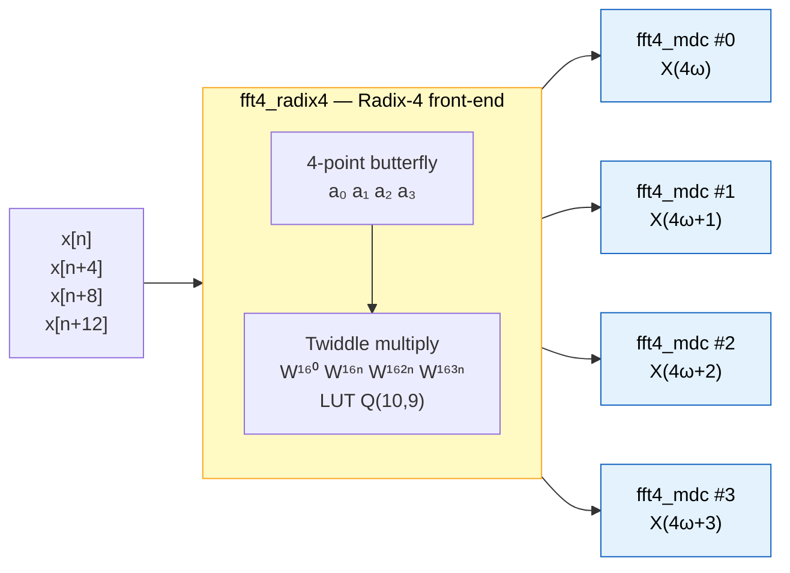
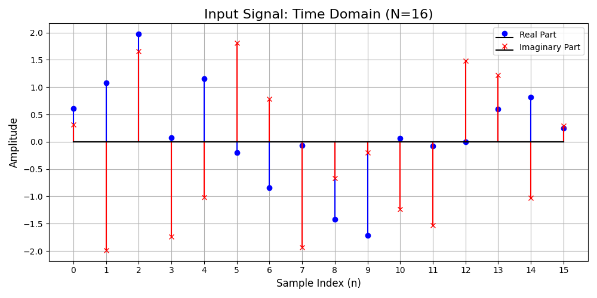
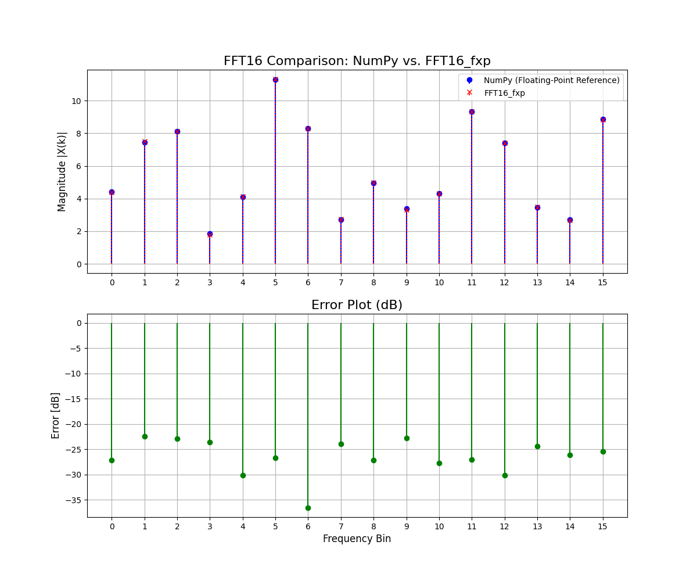
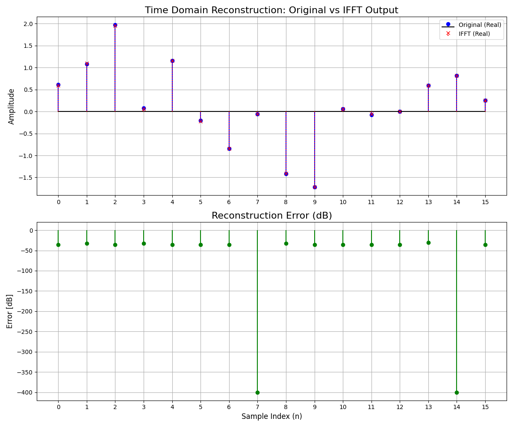
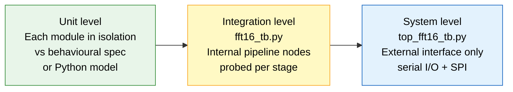
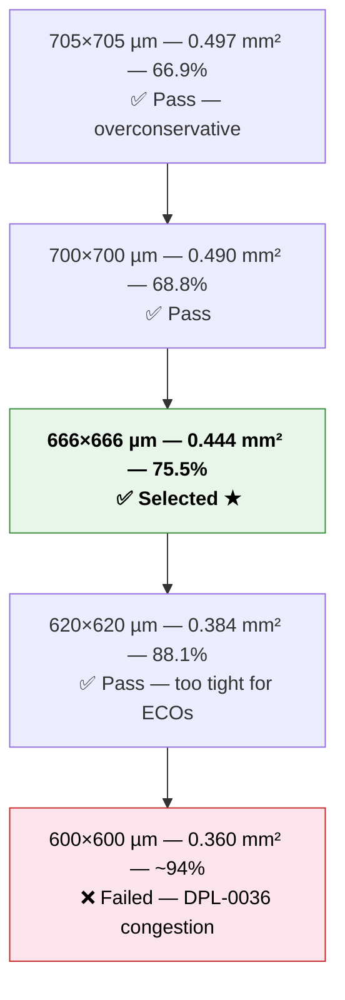
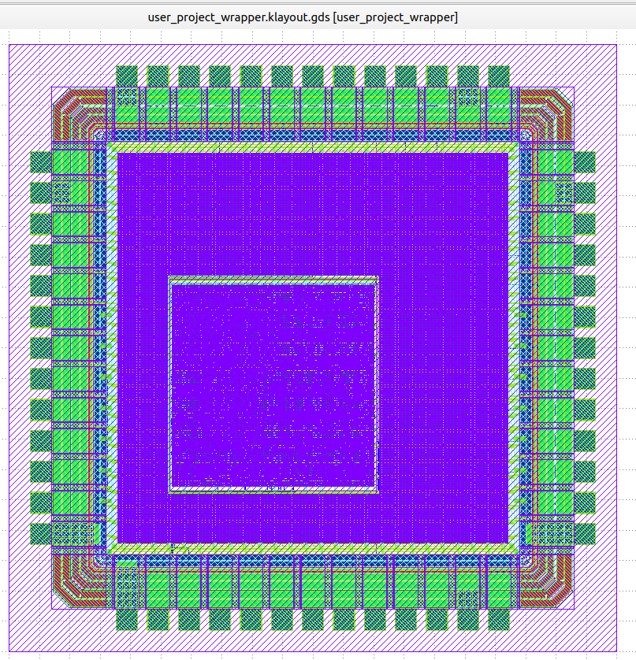
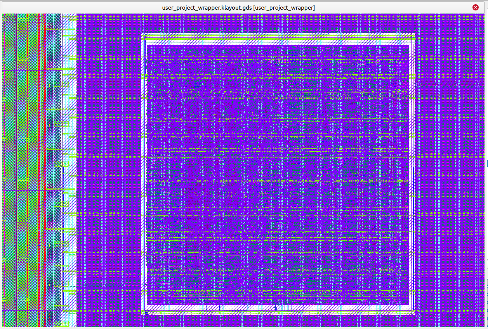
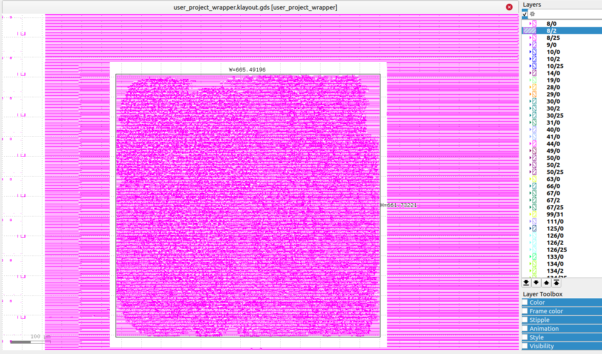

# parallel_fft16 — 16-Point Parallel FFT/IFFT Processor
### UNIC-CASS 2025 Tapeout Submission · IHP SG13G2 130 nm PDK

**Authors:**
- Cabrera, Augusto G.
- Font, Julian
- Lema, Adan J. A.
- Mosquera, Valentina
- Romero D., Agustín
- Villar, Federico I.

[](https://github.com/efabless/librelane)
[](https://github.com/IHP-GmbH/IHP-Open-PDK)
[](https://www.cocotb.org/)
[](https://github.com/Fundacion-Fulgor/parallel_fft16)

---

## ⚠️ Design Scaling Notice — FFT32 → FFT16

This submission is a **scaled-down redesign** of a previous FFT32 processor submitted to the same program. The prior submission received feedback indicating that the projected die area exceeded the available silicon budget within UNIC-CASS 2025. In response, the transform size was reduced from 32 to 16 points and the architecture was restructured accordingly.

| Metric | FFT32 (previous) | FFT16 (this work) |
|---|---|---|
| Transform size | 32 | **16** |
| Architecture | Radix-4 + Radix-8 MDC | **Radix-4 + 4× Radix-2 MDC** |
| Macro die area | ~0.774 mm² (880×880 µm) | **0.473 mm²** (678×697 µm) |
| Wrapper die area | 2000×2000 µm | 2000×2000 µm |
| Core utilisation | 67.6% | **75.31%** |

The area was reduced by **39%** relative to the prior submission. Beyond the size reduction, the architecture was restructured: the FFT32 used a Radix-4 first stage followed by a Radix-8 MDC cascade, while the FFT16 uses a **Radix-4 front-end butterfly** followed by **four independent Radix-2 MDC pipelines** operating in parallel.

---

## Overview

`parallel_fft16` is a fully digital, fixed-point, streaming 16-point FFT/IFFT processor implemented in synthesisable SystemVerilog, taped out through the **UNIC-CASS 2025** program on the **IHP SG13G2 130 nm** open-source PDK.

The design computes both the **forward FFT** and the **inverse FFT (IFFT)**, selectable at runtime via SPI. Complex samples arrive serialised on a single-wire input, are processed through the mixed-radix parallel pipeline, and are output through a parallel-to-serial conversion chain. An SPI-accessible debug system provides runtime status monitoring, register readback, and soft-reset capability.

| Parameter | Value |
|---|---|
| Transform size | N = 16 |
| Architecture | Mixed-radix: Radix-4 (stage 1) + 4× Radix-2 MDC (stage 2) |
| Input format — FFT | Q(8,6) complex fixed-point |
| Output format — FFT | Q(8,3) complex fixed-point |
| Input format — IFFT | Q(8,3) complex fixed-point |
| Output format — IFFT | Q(8,6) complex fixed-point |
| System clock | 50 MHz |
| SPI clock | 10 MHz |
| Technology | IHP SG13G2 130 nm |
| Die area (macro) | 0.473 mm² |
| Core utilisation | 75.31% |

---

## Design Flow


---

## Algorithm — Parallel Mixed-Radix FFT

This section describes the mathematical basis of the parallel architecture, following the formulation by Palmer & Nelson (FPL 2004). The central idea is to decompose the N-point DFT into four independent sub-DFTs of length N/4, which can then be computed by four parallel pipelines fed by a common Radix-4 front-end.

### DFT Decomposition

The N-point DFT is defined as:

$$X(\omega) = \sum_{n=0}^{N-1} x[n]\, W_N^{\,\omega n}, \qquad W_N = e^{-j2\pi/N}$$

The output spectrum is split into four interleaved blocks of length N/4:

$$X(4\omega),\quad X(4\omega+1),\quad X(4\omega+2),\quad X(4\omega+3)
\qquad \omega = 0,1,\ldots,N/4-1$$

Each block is expanded by separating the input $x[n]$ into four groups of N/4 consecutive samples: $x[n]$, $x[n+N/4]$, $x[n+N/2]$, $x[n+3N/4]$. Applying the twiddle-factor identities $W_N^N = 1$ and $W_N^{Zn} = W_{N/Z}^n$, each block reduces to a length-N/4 DFT of a pre-processed input sequence $a_k[n]$:

$$X(4\omega+k) = \sum_{n=0}^{N/4-1} a_k[n]\; W_{N/4}^{\,\omega n}, \qquad k=0,1,2,3$$

The four pre-processed sequences are:

$$a_0[n] =  x[n] +  x[n+N/4] +  x[n+N/2] +  x[n+3N/4]$$

$$a_1[n] = \bigl(x[n] - j\,x[n+N/4] -  x[n+N/2] + j\,x[n+3N/4]\bigr)\cdot W_N^{\,n}$$

$$a_2[n] = \bigl(x[n] -  x[n+N/4] +  x[n+N/2] -  x[n+3N/4]\bigr)\cdot W_N^{\,2n}$$

$$a_3[n] = \bigl(x[n] + j\,x[n+N/4] -  x[n+N/2] - j\,x[n+3N/4]\bigr)\cdot W_N^{\,3n}$$

Note that all four sub-DFTs share the **same twiddle factor set** $W_{N/4}^{\omega n}$, so they can be implemented as four identical independent pipelines. The only specialised hardware needed is the front-end circuit that computes $\{a_0, a_1, a_2, a_3\}$ — a conventional 4-point butterfly followed by twiddle multiplications $W_N^0$, $W_N^n$, $W_N^{2n}$, $W_N^{3n}$.

### Mapping to Hardware for N = 16

For N = 16, each sub-DFT has length N/4 = 4.
The front-end computes $a_k[n]$ using `fft4_radix4` (Radix-4 butterfly + twiddle LUT in Q(10,9)). Each length-4 sub-DFT is then computed by one of the four `fft4_mdc` instances (Radix-2 MDC pipeline).



### 16-Point DIF FFT Data-Flow Graph

The figure below shows the standard 16-point decimation-in-frequency (DIF) signal flow graph. The first two stages — corresponding to the Radix-4 front-end — involve data dependencies across all inputs. After those stages the computation splits into four fully independent branches, each mapped to one `fft4_mdc` pipeline.


*16-point DIF FFT signal flow graph. The horizontal dashed lines mark the boundary between the shared Radix-4 front-end (left) and the four independent Radix-2 MDC pipelines (right). Based on Palmer & Nelson, FPL 2004.*

### Fixed-Point Pipeline Diagram


*Word formats at each stage of the FFT/IFFT pipeline. FFT path (top): Q(8,6) input narrows to Q(8,3) output. IFFT path (bottom): Q(8,3) input widens to Q(8,6) output, with the 1/N normalisation absorbed into the clip_round output format.*

### IFFT Mode

The same hardware is reused for the inverse transform with two changes:

1. The ±j rotation in `fft4_mdc_stage1` flips sign: $+j$ instead of $-j$.
2. `clip_round` uses `NBF_OUT = NBF_MDC + 4` in IFFT mode instead of the FFT value, setting the output format to Q(8,6). Since $2^4 = N = 16$, this is equivalent to the $1/N$ normalisation — no explicit divider or shift register is instantiated.

---

## Architecture

### System Block Diagram


### Module Hierarchy

| Module | Role |
|---|---|
| `fft16_project` | UNIC-CASS wrapper top-level — pad ring integration |
| `top_fft16` | Functional top: FFT core + serial I/O + SPI debug |
| `fft16` | FFT computational core (no I/O peripherals) |
| `fft16_shift_r4` | Input deserialiser: 16 serial samples → 4 parallel outputs (delay chain) |
| `fft4_radix4` | Radix-4 butterfly with embedded twiddle LUT (combinatorial MUX, Q(10,9)) |
| `fft16_shift_r2` | Intermediate commutator — ×4 instances, one per MDC pipeline |
| `fft4_mdc` | Radix-2 MDC butterfly unit — ×4 instances |
| `fft4_mdc_stage1` | First butterfly stage + ±j rotation (FFT/IFFT selection) |
| `fft4_mdc_stage2` | Second butterfly stage |
| `fft4_mul` | Complex multiplier with dual `clip_round` paths (FFT / IFFT) |
| `btfly_2` | Radix-2 butterfly (purely combinatorial) |
| `ds_switch` | Data switch / commutator for MDC staging |
| `clip_round` | Parametric saturation + truncation/rounding |
| `complex_multiplier` | Generic complex multiplier |
| `buffer_parallel2serial` | Double-buffer FSM: 8 parallel complex → serialised stream |
| `rx_serializer` | Serial-to-parallel: start-bit detection, 16 samples per batch |
| `tx_serializer` | Parallel-to-serial output with start-bit framing |
| `debug_system` | SPI slave + debug unit wrapper |
| `spi_slave_mode0` | SPI Mode 0 (CPOL=0, CPHA=0), 16-bit frame [RW\|ADDR7\|DATA8] |
| `debug_unit` | Register map + CDC snapshot + `sys_config` write |
| `cdc_snapshot` | Double-flop synchroniser + snapshot on SS_N falling edge |

---

## High-Level Python Model

A **bit-accurate Python reference model** was developed alongside the RTL (`sim/fft16.py`, `sim/model_fft4.py`). It replicates the fixed-point arithmetic of every pipeline stage — twiddle factor quantisation, saturation, and truncation/rounding — using the `fxpmath` library.

### Fixed-Point Pipeline

| Stage | FFT format | IFFT format | Notes |
|---|---|---|---|
| Input | Q(8,6) | Q(8,3) | 8-bit signed |
| After Radix-4 butterfly | Q(10,6) | Q(10,3) | +2 guard bits |
| Twiddle factors | Q(10,9) | Q(10,9) | Embedded LUT |
| After twiddle multiply | Q(10,6) | Q(10,3) | |
| After MDC butterfly | Q(10,6) | Q(10,3) | |
| Output | Q(8,3) | Q(8,6) | Saturated |

The **IFFT 1/N normalisation** is implicit: in IFFT mode `clip_round` uses `NBF_OUT = NBF_MDC + 4`, which adds 4 fractional bits relative to the FFT output path, equivalent to dividing by $2^4 = 16 = N$.

### Validation Against NumPy

The model was validated against `numpy.fft.fft` / `numpy.fft.ifft` across random complex Q(8,6) input vectors. Three plots are produced by `sim/fft16.py` to document the validation.

**Input signal (time domain)**


*Random complex input vector quantised to Q(8,6). Real and imaginary parts shown as stem plots over the 16 sample indices.*

**FFT output — fixed-point model vs NumPy reference**


*Top: magnitude spectrum |X(k)| for the NumPy floating-point reference (blue) and the FFT16 fixed-point model (red). Bottom: per-bin error in dB between the two. The maximum absolute error is printed to stdout by the script.*

**IFFT reconstruction — original signal vs IFFT output**


*Top: original time-domain signal (blue) overlaid with the IFFT output after a full FFT → IFFT round-trip (red). Bottom: per-sample reconstruction error in dB. The SNR between the fixed-point model and the floating-point reference exceeds **20 dB** in both FFT and IFFT modes.*

The model is used as the **golden reference** in all cocotb testbenches — RTL outputs are compared sample-by-sample with tolerance `ε < 1e-9`.

---

## Verification

### Strategy



- **Unit level** — each module exercised in isolation against its behavioural specification (I/O protocol modules) or the Python model (arithmetic modules).
- **Integration level** — `fft16_tb.py` monitors internal pipeline signals (`fft4_valid`, `mdc_ffx_valid`, `rnd_mdc*`, `rnd_ifft*`) to confirm correctness at every stage before checking the final output.
- **System level** — `top_fft16_tb.py` drives the design exclusively through its external pins (serial data + SPI), replicating the exact protocol a real system would use.

---

### Test Plan

#### `rx_serializer_tb.py` — module: `rx_serializer`

| Test | Scope |
|---|---|
| `test_basic_deserialization` | Drives 16 known IQ pairs with proper start-bit framing. Reconstructs each sample from `o_data` and `o_valid` and verifies both re and im bytes match the expected signed 8-bit values exactly. |
| `test_valid_single_pulse` | Monitors `o_valid` across an entire batch transmission. Asserts it is high for exactly one clock cycle per sample — no double-pulses, no missed pulses. |
| `test_consecutive_batches` | Sends two back-to-back batches with random data separated by a single idle cycle. Verifies the FSM re-arms correctly after each batch and no sample is lost at the boundary. |
| `test_spurious_then_valid` | Sends an all-zero batch followed by a valid batch. Verifies both batches are received correctly and the FSM does not conflate the two. |

---

#### `tx_serializer_tb.py` — module: `tx_serializer`

| Test | Scope |
|---|---|
| `test_basic_serialization` | Feeds 16 IQ pairs and reconstructs each 16-bit word from the serial `o_data` stream, comparing against `{re[7:0], im[7:0]}` for every sample. |
| `test_start_bit_only_on_first` | Verifies the start bit (`o_data = 1` before the first data bit) appears only on the first sample of the batch, not on samples 1–15. |
| `test_ready_deasserts_during_tx` | Checks that `o_ready` goes low immediately after `i_valid` is accepted and returns high only after all bits of that sample have been transmitted. |
| `test_consecutive_batches` | Sends two full 16-sample batches back to back. Verifies each produces an independently framed serial output with its own start bit and no dropped samples at the boundary. |
| `test_data_ignored_when_busy` | Asserts `i_valid` with new data while a previous transmission is still in progress. Verifies the ongoing output is not corrupted and the new input is silently discarded. |

---

#### `buffer_parallel2serial_tb.py` — module: `buffer_parallel2serial`

| Test | Scope |
|---|---|
| `test_basic_ordering` | Feeds two batches of 8 IQ pairs, collects all 16 outputs via the `i_tx_ready` / `o_valid` handshake, and verifies the flat output order is batch0[0..7] followed by batch1[0..7] with no reordering. |
| `test_backpressure` | Receiver holds busy for 5 cycles after each sample. Verifies the FSM stalls in `S_WAIT_BSY` and no sample is dropped or reordered under sustained backpressure. |
| `test_delayed_ready` | Both batches are fed before `i_tx_ready` is ever asserted. After a 20-cycle delay, collection begins. Verifies `S_WAIT_RDY` holds the data intact and no sample is lost. |
| `test_random` | Random signed 8-bit re/im values across two batches, random busy duration between 2 and 8 cycles per sample. Verifies end-to-end ordering is preserved under unpredictable backpressure patterns. |

---

#### `buffer_tx_tb.py` — modules: `buffer_parallel2serial` + `tx_serializer`

| Test | Scope |
|---|---|
| `test_basic_integration` | Feeds two 8-sample batches through both modules end-to-end. Reconstructs the serial output from `o_data` and verifies all 16 samples arrive in order and match the input values. |
| `test_start_bit_framing` | Verifies the start bit appears at the correct bit position in the combined serial output stream for the first sample of the 16-sample frame. |
| `test_random_data` | Random signed 8-bit re/im values across two batches. Verifies end-to-end ordering is preserved through the full parallel-to-serial conversion path. |
| `test_consecutive_frame_batches` | Sends two complete 16-sample frames back to back. Verifies each produces a properly framed serial output with an independent start bit and no inter-frame corruption. |

---

#### `fft16_shift_r4_tb.py` — module: `fft16_shift_r4`

| Test | Scope |
|---|---|
| `test_fft16_shift_r4` | Injects 16 samples with gapped valid pulses (one active every 8 cycles). When `o_valid` is asserted, verifies the four output taps carry the correct delayed samples: `o_data0` at delay 13, `o_data1` at delay 9, `o_data2` at delay 5, `o_data3` at delay 1 — all relative to the most recent valid input. Verifies valid gating: outputs do not update between valid pulses. |

---

#### `fft16_shift_r2_tb.py` — module: `fft16_shift_r2`

| Test | Scope |
|---|---|
| `test_fft16_shift_r2` | Injects 16 samples with gapped valid pulses (one active every 8 cycles). When `o_valid` is asserted, verifies `o_data0` holds the sample at delay 3 and `o_data1` holds the sample at delay 1, both relative to the most recent valid input. Verifies valid gating between pulses. |

---

#### `fft4_mdc_tb.py` — module: `fft4_mdc`

| Test | Scope |
|---|---|
| `test_fft4_mdc_debug` | Drives one set of 4 complex inputs through the MDC unit with `i_inverse = 0` (FFT) and then `i_inverse = 1` (IFFT). Captures stage 1 output (`u_fft4_mdc_stage1.o_valid`) and stage 2 output (`o_valid`) separately for each mode. Compares both stages against the `FFT4_Reference` Python model. Tolerance: 1 LSB at Q(8,6) resolution. |

---

#### `fft16_tb.py` — module: `fft16`

| Test | Scope |
|---|---|
| `test_fft16_fft` | Forward FFT: `i_inverse = 0`, input Q(8,6), output Q(8,3). Injects 16 random complex samples with gapped valid pulses. Probes and compares four internal checkpoints against the `FFT16` Python model: (1) Radix-4 stage output at `fft4_valid`, (2) MDC pre-clip output at `mdc_ffx_valid`, (3) clip_round output `rnd_mdc*`, (4) final buffer output through `tx_serializer` model. Each checkpoint compared with ε < 1e-9. |
| `test_fft16_ifft` | Inverse FFT: `i_inverse = 1`, input Q(8,3), output Q(8,6). Same four-checkpoint procedure as the FFT test but using the IFFT model path. Captures `rnd_ifft*` signals for the clip_round stage. Verifies the implicit 1/N normalisation is correctly applied through the output format alone. |

---

#### `debug_unit_tb.py` — module: `debug_unit`

| Test | Scope |
|---|---|
| `test_sys_config_write` | Issues write transactions for all 8 possible values of `sys_config` (0b000 through 0b111). After each write, reads `dut.sys_config` directly and confirms the register updated to the written value. |
| `test_sys_config_readback` | Writes three distinct values to `sys_config` and reads each back via `spi_rdata` at address `0x10`. Verifies the read multiplexer returns the correct value at the `sys_config` address. |
| `test_status_snapshot` | Sets known values on all 7 probe inputs, triggers a CDC snapshot by asserting `spi_ss_n`, then reads each register address and verifies the frozen value matches the state at snapshot time. |
| `test_cdc_snapshot_freeze` | Triggers a snapshot, then modifies all probe inputs while `spi_ss_n` remains asserted. Reads all registers after `spi_ss_n` de-asserts and verifies the snapshot still holds the original pre-change values, not the updated ones. |
| `test_cdc_snapshot_update` | Takes two consecutive snapshots with different probe values between them. Verifies the first snapshot holds the first set and the second snapshot holds the updated set independently. |
| `test_default_address` | Reads from four unmapped addresses (0x07, 0x0F, 0x11, 0x7F). Verifies `spi_rdata` returns `0x00` for each, confirming the read multiplexer defaults to zero for undefined addresses. |
| `test_random_snapshot` | Over 8 random iterations: sets random probe values, triggers a snapshot, randomises all probe inputs, then reads all 7 status registers and verifies each matches the value captured at snapshot time. |

---

#### `debug_system_tb.py` — module: `debug_system`

| Test | Scope |
|---|---|
| `test_spi_write_sys_config` | Drives complete real 16-bit SPI frames (CPOL=0, CPHA=0) for all 8 `sys_config` values. Verifies the `sys_config` output port updates correctly after SS_N de-asserts at the end of each frame. |
| `test_spi_read_status_register` | Sets known values on all probe inputs, issues SPI READ frames for each of the 7 status register addresses, and verifies the byte clocked out on MISO matches the expected register content. |
| `test_spi_read_sys_config` | Writes four values to `sys_config` via SPI WRITE frames, then reads back each via SPI READ at address `0x10`. Verifies the MISO byte matches the previously written value in every case. |
| `test_cdc_snapshot_timing` | Pulls SS_N low and waits 5 system clock cycles for the snapshot pulse to propagate through the double-flop synchroniser. Changes all probe inputs while SS_N is still asserted. Clocks out a full READ frame and verifies MISO returns the frozen pre-change value. Issues a second READ after a new SS_N pulse and verifies it now captures the updated values. |
| `test_random_rw` | Over 6 random iterations: sets random probe values, issues an SPI READ for each status register and verifies MISO, then writes a random `sys_config` value via SPI WRITE and verifies the output port. |

---

#### `top_fft16_tb.py` — module: `top_fft16`

| Test | Scope |
|---|---|
| `test_fft_disabled_no_output` | With `SYS_CONFIG = 0b000`, streams a full 16-sample block and monitors `o_data` for 200 cycles. Verifies `o_data` remains 0 throughout, `cnt_inputs = 16`, and `cnt_outputs = 0`. |
| `test_enable_counters_and_status` | Enables FFT via SPI (`SYS_CONFIG = 0b001`), drives one block, captures all 16 output samples. Verifies: at least one non-zero output, `cnt_inputs = cnt_outputs = 16`, `status_flags[2] = 1` (tx_ready), `status_flags[3] = 0` (FFT mode), `last_out_re/im` match the final captured sample. |
| `test_zero_input` | Drives 16 all-zero IQ pairs in FFT mode. Verifies all 16 output samples are exactly (0, 0) and `error_flags[0] = 0` (no saturation). |
| `test_soft_reset` | Drives a complete block, reads counters, issues a soft reset via SPI (bit 2 of `SYS_CONFIG`), clears the reset, and reads counters again. Verifies counters reset to 0. Drives a second block and confirms all 16 outputs are received. |
| `test_spi_last_out_tracking` | Drives two consecutive blocks with a soft reset between them. After each block reads `last_out_re` and `last_out_im` via SPI and verifies they match the final sample of the serial output for that block. |
| `test_dc_input_energy` | Drives 16 identical real-valued samples (DC, A=4) in FFT mode. Verifies exactly one non-zero output bin (bin 0 at physical index 0), all other 15 bins are (0, 0), and no clipping is flagged. |
| `test_fft_mathematical_roundtrip` | Drives random complex Q(8,6) inputs in FFT mode. Captures all 16 serial outputs and compares each against the `FFT16` Python model using the MDC output reorder map `MDC_MAP`. Tolerance: ε < 1e-9. |
| `test_ifft_status_flag` | Enables IFFT mode via SPI (`SYS_CONFIG = 0b011`) and reads `status_flags`. Verifies bit 3 (`fft_inverse`) is 1. |
| `test_ifft_zero_input` | Drives 16 all-zero samples in IFFT mode. Verifies all 16 outputs are (0, 0) and `error_flags[0] = 0`. |
| `test_ifft_dc_bin` | Constructs a frequency-domain input with only bin 0 active (A=32, Q(8,3)) and drives it through IFFT mode. Verifies all 16 time-domain output samples have `re = A/N = 16` (Q(8,6)) and `im = 0`. |
| `test_ifft_counters` | Drives one full block in IFFT mode. Verifies `cnt_inputs = cnt_outputs = 16` and `last_out_re/im` match the final captured sample. |
| `test_ifft_mathematical_roundtrip` | Drives random Q(8,3) frequency-domain inputs in IFFT mode. Captures all 16 serial outputs and compares each against the `FFT16` Python model IFFT path using `MDC_MAP`. Tolerance: ε < 1e-9. |
| `test_fft_ifft_mode_switch` | Three-block sequence: FFT (seed 7) → soft reset → IFFT (seed 13) → soft reset → FFT (seed 21), with full pipeline drain between each mode change. Each block must pass bit-exact comparison against the Python model. |

---

## Interface / Pinout

The following interface applies to `top_fft16`:

| Signal | Direction | Width | Description |
|---|---|---|---|
| `i_clk` | Input | 1 | System clock — 50 MHz |
| `i_rst_n` | Input | 1 | Active-low synchronous reset |
| `i_data` | Input | 1 | Serial IQ input (start-bit framed) |
| `o_data` | Output | 1 | Serial IQ output (start-bit framed) |
| `i_spi_sclk` | Input | 1 | SPI clock — 10 MHz |
| `i_spi_ss_n` | Input | 1 | SPI chip select (active low) |
| `i_spi_mosi` | Input | 1 | SPI data in |
| `o_spi_miso` | Output | 1 | SPI data out |

**Serial data protocol:** A batch starts with one idle cycle (`i_data = 0`) followed by one start bit (`i_data = 1`). Then 16 samples of 16 bits each (`[re(7:0) im(7:0)]`, MSB first) follow contiguously with no gaps. The same framing applies to `o_data`.

---

## Register Map

All registers are 8-bit. SPI frame: `[RW(1) | ADDR(7) | DATA(8)]`, MSB first.

| Address | Name | R/W | Description |
|---|---|---|---|
| `0x00` | `STATUS_FLAGS` | R | [3] fft_inverse · [2] tx_ready · [1] rx_valid · [0] fft_valid |
| `0x01` | `ERROR_FLAGS` | R | [0] clip_flag — output saturation detected |
| `0x02` | `CNT_INPUTS` | R | Input sample counter (wraps at 255) |
| `0x03` | `CNT_OUTPUTS` | R | Output sample counter (wraps at 255) |
| `0x04` | `LAST_OUT_RE` | R | Real part of the last output sample |
| `0x05` | `LAST_OUT_IM` | R | Imaginary part of the last output sample |
| `0x06` | `MID_DATA_RE` | R | Real part of a mid-pipeline debug probe |
| `0x10` | `SYS_CONFIG` | R/W | [2] soft_reset · [1] i_inverse · [0] fft_enable |

Write `0x01` to enable FFT mode. Write `0x03` for IFFT mode. Write `0x04` to assert soft reset, then clear to `0x01` or `0x03` to resume.

---

## Synthesis Results

### Macro — `user_project`

| Metric | Value |
|---|---|
| Die bounding box | 678.15 × 697.14 µm |
| Die area | **0.473 mm²** |
| Core area | 0.440 mm² |
| Core utilisation | **75.31%** |
| Standard cells | 22,805 |
| Sequential cells | 2,148 |
| Timing-repair buffers | 4,141 |
| Total power | 10.42 mW |

### Timing — 50 MHz, all corners

| Corner | Setup WNS | Hold WNS | Violations |
|---|---|---|---|
| `nom_slow_1p08V_125C` (worst) | +7.305 ns | +0.104 ns | 0 / 0 |
| `nom_typ_1p20V_25C` | +9.066 ns | +0.170 ns | 0 / 0 |
| `nom_fast_1p32V_m40C` | +11.808 ns | +0.188 ns | 0 / 0 |

### Physical Signoff

| Check | Result |
|---|---|
| DRC (routing, Magic, KLayout) | ✅ 0 errors |
| LVS | ✅ 0 errors |
| Antenna violations | ✅ 0 violations |
| IR Drop (worst) | 2.71 mV (supply 1.2 V) |
| Lint errors | 0 |
| Inferred latches | 0 |

### Wrapper — `fft16_project`

| Metric | Value |
|---|---|
| Die area | 4.0 mm² (2000×2000 µm) |
| Core utilisation | 28.75% |
| Pad cells | 184 |
| Macro instances | 1 (`user_project`, 0.473 mm²) |
| Setup WNS (worst) | +4.758 ns |
| DRC / LVS / Antenna | ✅ PASS |

---

## Physical Design

### Area Sweep



The **666×666 µm** configuration was selected. The 620×620 µm run also passed all signoff checks but its 88.1% utilisation leaves insufficient margin for future RTL changes or ECOs. The 600×600 µm attempt failed at detailed placement due to routing congestion (DPL-0036, post-GPL density > 0.98).

**Clock tree:** 232 buffers + 111 inverters · worst skew 0.150 ns  
**Routing:** 22,697 nets · 118,502 vias · 595,252 µm wirelength

For the complete physical design report including area increase justification (`top_fft16` vs `user_project`), routing metrics, and full signoff tables, see [Physical Design Parallel FFT16 Study](docs/pd_report/).

### Layout


*Full UNIC-CASS wrapper — `user_project_wrapper`, 2000×2000 µm. The central square is the FFT16 macro (`user_project`). The surrounding region contains pad-ring connectivity and wrapper-level routing.*


*Zoomed view showing the `user_project` region (central square, 678×697 µm) within the wrapper boundary.*


*Metal layer view of the final implemented layout (`user_project_wrapper`).*

---

## Repository Structure

```
parallel_fft16/
├── rtl/
│   ├── top_fft16.sv
│   ├── fft16.sv
│   ├── fft4_radix4.sv
│   ├── fft4_mdc.sv
│   ├── fft4_mdc_stage1.sv
│   ├── fft4_mdc_stage2.sv
│   ├── clip_round.sv
│   ├── complex_multiplier.sv
│   ├── fft16_shift_r4.sv
│   ├── fft16_shift_r2.sv
│   ├── buffer_parallel2serial.sv
│   ├── tx_serializer.sv
│   ├── rx_serializer.sv
│   ├── debug_system.sv
│   ├── spi_slave_mode0.sv
│   ├── debug_unit.sv
│   └── cdc_snapshot.sv
├── sim/
│   ├── fft16.py
│   ├── model_fft4.py
│   ├── top_fft16_tb.py
│   ├── fft16_tb.py
│   ├── fft4_mdc_tb.py
│   ├── fft16_shift_r4_tb.py
│   ├── fft16_shift_r2_tb.py
│   ├── rx_serializer_tb.py
│   ├── tx_serializer_tb.py
│   ├── buffer_parallel2serial_tb.py
│   ├── buffer_tx_tb.py
│   ├── debug_unit_tb.py
│   └── debug_system_tb.py
├── docs/
│   ├── img/
│   │   ├── fft16_dfg.png           ← 16-point DIF FFT signal flow graph
│   │   ├── fft16_fxp_pipeline.png  ← fixed-point format chain diagram
│   │   ├── input_fft16.png         ← model output: Q(8,6) input signal (time domain)
│   │   ├── result_fft16.png        ← model output: FFT16 fxp vs NumPy (magnitude + error dB)
│   │   ├── result_ifft16.png       ← model output: IFFT reconstruction + error dB
│   │   ├── layout_wrapper.png
│   │   ├── layout_user_project.png
│   │   └── layout_wrapper_metal.png
│   └── pd_report/
├── fft16_project.v
└── README.md
```

---

## How to Run Verification

```bash
pip install cocotb fxpmath numpy
cd tests
./run_all_tests.sh
```

---

## Reference

Palmer, J. & Nelson, B. (2004). *A Parallel FFT on an FPGA Using Hardware Generation.*
In: Becker J., Platzner M., Vernalde S. (eds) *Field Programmable Logic and Application.*
FPL 2004. LNCS vol. 3203, pp. 948–953. Springer, Berlin, Heidelberg.