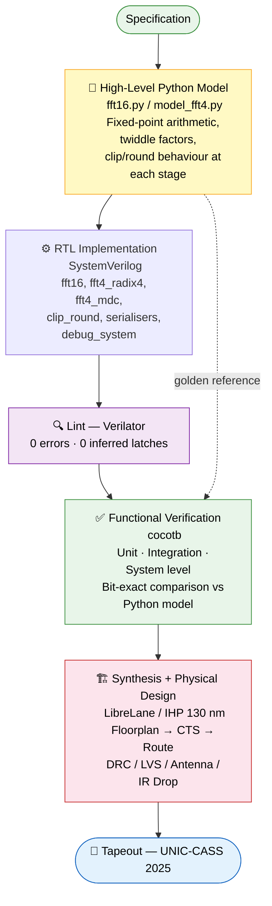
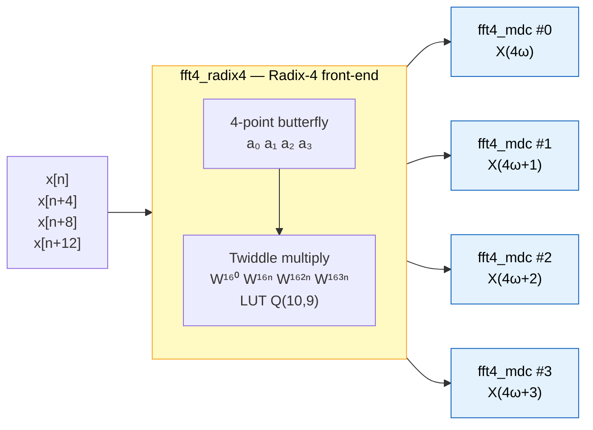
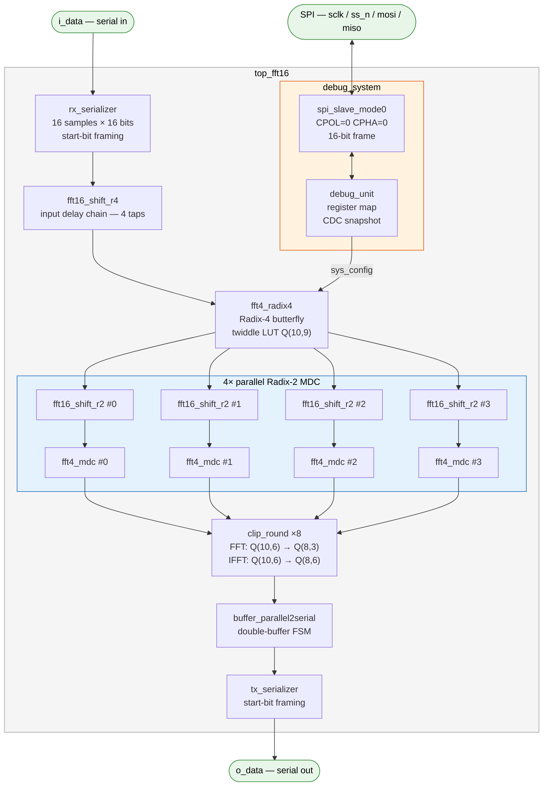
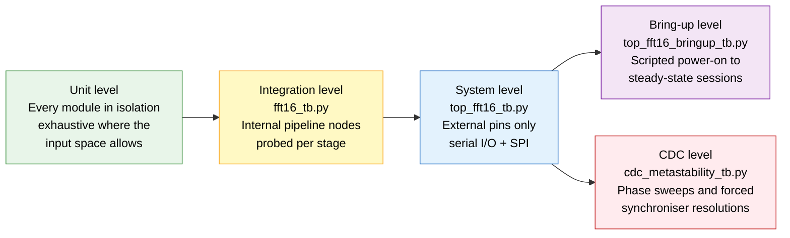
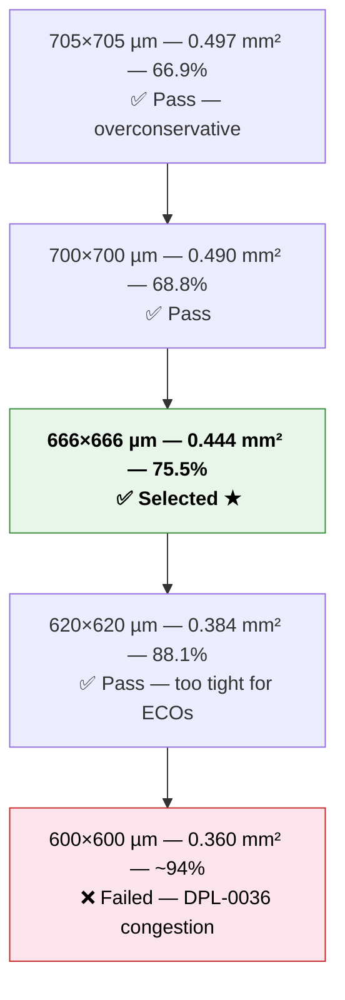

# parallel_fft16:  16-Point Parallel FFT/IFFT Processor
### UNIC-CASS 2025 Tapeout Submission · IHP SG13G2 130 nm PDK

**Authors:**
- Cabrera, Augusto G.
- Font, Julian
- Lema, Adan J. A.
- Mosquera, Valentina
- Romero D., Agustín
- Villar, Federico I.

[](https://github.com/efabless/librelane)
[](https://github.com/IHP-GmbH/IHP-Open-PDK)
[](https://www.cocotb.org/)
[](https://github.com/Fundacion-Fulgor/parallel_fft16)

---

## ⚠️ Design Scaling Notice: FFT32 → FFT16

This submission is a **scaled-down redesign** of a previous FFT32 processor submitted to the same program. The prior submission received feedback indicating that the projected die area exceeded the available silicon budget within UNIC-CASS 2025. In response, the transform size was reduced from 32 to 16 points and the architecture was restructured accordingly.

| Metric | FFT32 (previous) | FFT16 (this work) |
|---|---|---|
| Transform size | 32 | **16** |
| Architecture | Radix-4 + Radix-8 MDC | **Radix-4 + 4× Radix-2 MDC** |
| Macro die area | ~0.774 mm² (880×880 µm) | **0.473 mm²** (678×697 µm) |
| Wrapper die area | 2000×2000 µm | 2000×2000 µm |
| Core utilisation | 67.6% | **75.31%** |

The area was reduced by **39%** relative to the prior submission. Beyond the size reduction, the architecture was restructured: the FFT32 used a Radix-4 first stage followed by a Radix-8 MDC cascade, while the FFT16 uses a **Radix-4 front-end butterfly** followed by **four independent Radix-2 MDC pipelines** operating in parallel.

---

## Overview

`parallel_fft16` is a fully digital, fixed-point, streaming 16-point FFT/IFFT processor implemented in synthesisable SystemVerilog, taped out through the **UNIC-CASS 2025** program on the **IHP SG13G2 130 nm** open-source PDK.

The design computes both the **forward FFT** and the **inverse FFT (IFFT)**, selectable at runtime via SPI. Complex samples arrive serialised on a single-wire input, are processed through the mixed-radix parallel pipeline, and are output through a parallel-to-serial conversion chain. An SPI-accessible debug system provides runtime status monitoring, register readback, and soft-reset capability.

| Parameter | Value |
|---|---|
| Transform size | N = 16 |
| Architecture | Mixed-radix: Radix-4 (stage 1) + 4× Radix-2 MDC (stage 2) |
| Input format — FFT | Q(8,6) complex fixed-point |
| Output format — FFT | Q(8,3) complex fixed-point |
| Input format — IFFT | Q(8,3) complex fixed-point |
| Output format — IFFT | Q(8,6) complex fixed-point |
| System clock | 50 MHz |
| SPI clock | 10 MHz |
| Technology | IHP SG13G2 130 nm |
| Die area (macro) | 0.473 mm² |
| Core utilisation | 75.31% |

---

## Design Flow



---

## Algorithm: Parallel Mixed-Radix FFT

This section describes the mathematical basis of the parallel architecture, following the formulation by Palmer & Nelson (FPL 2004). The central idea is to decompose the N-point DFT into four independent sub-DFTs of length N/4, which can then be computed by four parallel pipelines fed by a common Radix-4 front-end.

### DFT Decomposition

The N-point DFT is defined as:

$$X(\omega) = \sum_{n=0}^{N-1} x[n]\, W_N^{\,\omega n}, \qquad W_N = e^{-j2\pi/N}$$

The output spectrum is split into four interleaved blocks of length N/4:

$$X(4\omega),\quad X(4\omega+1),\quad X(4\omega+2),\quad X(4\omega+3)
\qquad \omega = 0,1,\ldots,N/4-1$$

Each block is expanded by separating the input $x[n]$ into four groups of N/4 consecutive samples: $x[n]$, $x[n+N/4]$, $x[n+N/2]$, $x[n+3N/4]$. Applying the twiddle-factor identities $W_N^N = 1$ and $W_N^{Zn} = W_{N/Z}^n$, each block reduces to a length-N/4 DFT of a pre-processed input sequence $a_k[n]$:

$$X(4\omega+k) = \sum_{n=0}^{N/4-1} a_k[n]\; W_{N/4}^{\,\omega n}, \qquad k=0,1,2,3$$

The four pre-processed sequences are:

$$a_0[n] =  x[n] +  x[n+N/4] +  x[n+N/2] +  x[n+3N/4]$$

$$a_1[n] = \bigl(x[n] - j\,x[n+N/4] -  x[n+N/2] + j\,x[n+3N/4]\bigr)\cdot W_N^{\,n}$$

$$a_2[n] = \bigl(x[n] -  x[n+N/4] +  x[n+N/2] -  x[n+3N/4]\bigr)\cdot W_N^{\,2n}$$

$$a_3[n] = \bigl(x[n] + j\,x[n+N/4] -  x[n+N/2] - j\,x[n+3N/4]\bigr)\cdot W_N^{\,3n}$$

Note that all four sub-DFTs share the **same twiddle factor set** $W_{N/4}^{\omega n}$, so they can be implemented as four identical independent pipelines. The only specialised hardware needed is the front-end circuit that computes $\{a_0, a_1, a_2, a_3\}$ — a conventional 4-point butterfly followed by twiddle multiplications $W_N^0$, $W_N^n$, $W_N^{2n}$, $W_N^{3n}$.

### Mapping to Hardware for N = 16

For N = 16, each sub-DFT has length N/4 = 4.
The front-end computes $a_k[n]$ using `fft4_radix4` (Radix-4 butterfly + twiddle LUT in Q(10,9)). Each length-4 sub-DFT is then computed by one of the four `fft4_mdc` instances (Radix-2 MDC pipeline).



### IFFT Mode

The same hardware is reused for the inverse transform with two changes:

1. The ±j rotation in `fft4_mdc_stage1` flips sign: $+j$ instead of $-j$.
2. `clip_round` uses `NBF_OUT = NBF_MDC + 4` in IFFT mode instead of the FFT value, setting the output format to Q(8,6). Since $2^4 = N = 16$, this is equivalent to the $1/N$ normalisation — no explicit divider or shift register is instantiated.

---

## Architecture

### System Block Diagram



### Module Hierarchy

| Module | Role |
|---|---|
| `fft16_project` | UNIC-CASS wrapper top-level — pad ring integration |
| `top_fft16` | Functional top: FFT core + serial I/O + SPI debug |
| `fft16` | FFT computational core (no I/O peripherals) |
| `fft16_shift_r4` | Input deserialiser: 16 serial samples → 4 parallel outputs (delay chain) |
| `fft4_radix4` | Radix-4 butterfly with embedded twiddle LUT (combinatorial MUX, Q(10,9)) |
| `fft16_shift_r2` | Intermediate commutator — ×4 instances, one per MDC pipeline |
| `fft4_mdc` | Radix-2 MDC butterfly unit — ×4 instances |
| `fft4_mdc_stage1` | First butterfly stage + ±j rotation (FFT/IFFT selection) |
| `fft4_mdc_stage2` | Second butterfly stage |
| `fft4_mul` | Twiddle multiplier with rounding and saturation |
| `btfly_2` | Radix-2 butterfly (purely combinatorial) |
| `ds_switch` | Data switch / commutator for MDC staging |
| `clip_round` | Parametric saturation + truncation or round-to-nearest-even |
| `buffer_parallel2serial` | Double-buffer FSM: 8 parallel complex → serialised stream |
| `rx_serializer` | Serial-to-parallel: start-bit detection, 16 samples per batch |
| `tx_serializer` | Parallel-to-serial output with start-bit framing |
| `debug_system` | SPI slave + debug unit wrapper |
| `spi_slave_mode0` | SPI Mode 0 (CPOL=0, CPHA=0), 16-bit frame [RW\|ADDR7\|DATA8] |
| `debug_unit` | Register map + CDC snapshot + `sys_config` write |
| `cdc_snapshot` | Three-flop synchroniser + snapshot on SS_N falling edge |

---

## High-Level Python Model

`model/fft16.py` is the **golden reference** for this design. It replicates the fixed-point arithmetic of every pipeline stage — twiddle quantisation, saturation and rounding — using the `fxpmath` library, and the RTL is required to match it **bit for bit**, not within a tolerance.

The testbenches import it directly, through `export PYTHONPATH := $(PWD)/../../model` in the suite Makefiles. There is deliberately no second copy: earlier copies kept under `tests/` had silently drifted from the golden model and were removed.

### Fixed-Point Pipeline

| Stage | FFT format | IFFT format | Rounding | Notes |
|---|---|---|---|---|
| Input | Q(8,6) | Q(8,3) | — | 8-bit signed |
| After Radix-4 butterfly | Q(10,6) | Q(10,3) | exact | +2 guard bits, no bits discarded |
| Twiddle factors | Q(10,9) | Q(10,9) | nearest-even | Embedded LUT |
| After twiddle multiply | Q(10,6) | Q(10,3) | **nearest-even** | `clip_round` `RND_MD = 1` |
| After MDC butterfly | Q(10,6) | Q(10,3) | exact | +2 guard bits |
| Output | Q(8,3) | Q(8,6) | **nearest-even** | `clip_round` `RND_MD = 1`, saturating |

Both rounding points discard fractional bits with **round to nearest, ties to even**, matching `fxpmath`'s `'around'` mode used by the golden model. In hardware this costs one adder whose carry-in is the LSB of the truncated result:

```verilog
localparam [NB_INP:0] RND_BIAS = (BITS_DIS > 0) ? ((1 << BITS_DIS) / 2 - 1) : 0;
sum = {i_data[NB_INP-1], i_data} + RND_BIAS + i_data[BITS_DIS];
```

Adding `2^(k-1) - 1` plus the LSB of the truncated result resolves ties to the even neighbour without any explicit tie-detection logic.

The **IFFT 1/N normalisation** is implicit: in IFFT mode `clip_round` uses `NBF_OUT = NBF_MDC + 4`, which adds 4 fractional bits relative to the FFT output path, equivalent to dividing by $2^4 = 16 = N$.

### Validation Against NumPy

The model was validated against `numpy.fft.fft` / `numpy.fft.ifft` across random complex Q(8,6) input vectors. Three plots are produced by running `python model/fft16.py` to document the validation.

**Input signal (time domain)**


*Random complex input vector quantised to Q(8,6). Real and imaginary parts shown as stem plots over the 16 sample indices.*

**FFT output: fixed-point model vs NumPy reference**


*Top: magnitude spectrum |X(k)| for the NumPy floating-point reference (blue) and the FFT16 fixed-point model (red). Bottom: per-bin error in dB between the two. The maximum absolute error is printed to stdout by the script.*

**IFFT reconstruction: original signal vs IFFT output**


*Top: original time-domain signal (blue) overlaid with the IFFT output after a full FFT → IFFT round-trip (red). Bottom: per-sample reconstruction error in dB. The SNR between the fixed-point model and the floating-point reference exceeds **20 dB** in both FFT and IFFT modes.*

`model/fft16.py` is importable as a library (`from fft16 import FFT16`); running it as a script regenerates the three plots above.

All cocotb testbenches compare RTL outputs against this model **bit-exactly**. Sub-block suites additionally use integer models that reproduce the RTL arithmetic exactly (`tests/clip_round/model_clip_round.py`, `tests/fft4_mul/model_fft4_mul.py`, `tests/fft4_radix4/model_fft4_radix4.py`); those are themselves cross-checked against the golden `ROUND` class over exhaustive sweeps.

---

## Verification

### Strategy



- **Unit level** — every RTL module has its own suite, including the leaf cells. Where the input space is small enough the sweep is genuinely exhaustive: all 65 536 operand pairs of `btfly_2`, the full input range of `clip_round` in its narrow configurations, all 256 values of `cdc_snapshot`, and all 128 addresses and 256 data values of `spi_slave_mode0`.
- **Integration level** — `fft16_tb.py` probes internal pipeline nodes (`fft4_valid`, `mdc_ffx_valid`, `rnd_mdc*`, `rnd_ifft*`) to confirm correctness at every stage before checking the final output.
- **System level** — `top_fft16_tb.py` drives the design exclusively through its external pins, replicating the exact protocol a real system would use.
- **Bring-up level** — `top_fft16_bringup_tb.py` runs long scripted sessions from power-on reset through steady-state streaming, checking the datapath and every debug register at each step. These are written to double as a bring-up procedure for silicon.
- **CDC level** — `cdc_metastability_tb.py` characterises the SPI-to-system clock domain crossing and measures its timing limits.

**Reference model layering.** Arithmetic blocks are checked against integer models that reproduce the RTL bit for bit; the FFT core and the chip top are checked against `model/fft16.py`. Structural stimuli (DC, impulse, single tones) additionally assert DSP-level properties — peak bin location, leakage floor, flat spectrum — that hold independently of any model.

**Metastability.** RTL simulation cannot reproduce metastability itself. What the CDC suite proves is that the design tolerates **either resolution** of a synchroniser first stage, which is the only thing a synchroniser guarantees. This is covered two ways: sweeping the asynchronous edge across every sub-cycle phase of the system clock, and forcing the first synchroniser stage to the opposite value for one cycle with `cocotb.handle.Force`.

---

All tests are currently passing.

| Suite | Level | Tests | Status |
|---|---|---|---|
| `btfly_2_tb.py` | unit | 8 | ✅ |
| `clip_round_tb.py` | unit | 11 | ✅ |
| `ds_switch_tb.py` | unit | 12 | ✅ |
| `cdc_snapshot_tb.py` | unit | 10 | ✅ |
| `fft4_mul_tb.py` | unit | 13 | ✅ |
| `fft4_mdc_tb.py` | unit | 13 | ✅ |
| `fft4_radix4_tb.py` | unit | 16 | ✅ |
| `fft16_shift_r4_tb.py` | unit | 12 | ✅ |
| `fft16_shift_r2_tb.py` | unit | 12 | ✅ |
| `buffer_parallel2serial_tb.py` | unit | 15 | ✅ |
| `rx_serializer_tb.py` | unit | 15 | ✅ |
| `tx_serializer_tb.py` | unit | 16 | ✅ |
| `spi_slave_mode0_tb.py` | unit | 16 | ✅ |
| `debug_unit_tb.py` | unit | 18 | ✅ |
| `buffer_tx_tb.py` | integration | 14 | ✅ |
| `debug_system_tb.py` | integration | 17 | ✅ |
| `fft16_tb.py` | integration | 13 | ✅ |
| `top_fft16_tb.py` | system | 28 | ✅ |
| `top_fft16_bringup_tb.py` | bring-up | 13 | ✅ |
| `cdc_metastability_tb.py` | CDC | 8 | ✅ |
| **Total** | | **280** | **✅ All passing** |
| `gls/` (bring-up on the netlist) | gate level | 13 | ✅ (run by hand) |

---

### Gate Level Simulation

`tests/gls/` re-runs the **entire bring-up suite against the synthesised
netlist** instead of the RTL. There is no second copy of the testbench: the
Makefile puts `tests/top_fft16_bringup` on `PYTHONPATH` and loads the same
module, which works because those tests only ever touch the eight top-level
ports. `gls_top.v` adapts the netlist's `fft16_project` interface
(`clk_i`, `rst_ni`, `ui_PAD2CORE`, `uo_CORE2PAD`) to the RTL port names.

```bash
cd tests/gls
make                          # uses runs/user_project_run by default
RUN_TAG=my_run make           # or point it at another run
```

It is **excluded from `run_all_tests.sh`** on purpose, so CI never tries to run
it: the netlist is a build artefact that is not in the repository. Run it by
hand after a physical flow. Override with `SKIP_TESTS=""` if you really want it
in the sweep.

Two things are needed to make the IHP cell models simulate under Icarus, both
handled by the Makefile:

- The models drive their flip-flops from `delayed_CLK`, `delayed_D` and
  `delayed_RESET_B`, wires that only the `specify` block produces. Icarus does
  not implement the delayed-signal outputs of `$setuphold`/`$recrem`, so those
  wires stay `X` and **every output of the design is `X` forever**.
  `prepare_models.py` rewrites them as direct aliases of the real ports into a
  generated copy under `sim_build/`. The PDK is never modified.
- The simulation is zero-delay. It verifies that the netlist is functionally
  equivalent to the RTL, not that it meets timing; timing is signed off by STA
  in the flow. Annotating the SDF would be the next step.

Result: **13/13 passing**, including the bit-exact comparison against
`model/fft16.py`. The netlist computes the same FFT as the RTL, sample for
sample.

---

### Characterisation and Operating Limits

Numbers measured in simulation at the nominal 50 MHz system clock. They are the constraints a driver has to respect, and are pinned by regression tests so they cannot silently regress.

#### Block pacing

| Quantity | Value |
|---|---|
| Input frame | 258 clocks (1 idle + 1 start bit + 16 × 16 bits) |
| Output readout | 274 clocks |
| Deficit per block | 16 clocks |
| Minimum gap, single pair of blocks | 18 clocks (zero margin) |
| **Qualified sustained gap** | **32 clocks** |

The chip consumes a block faster than it can emit one, and there is no back-pressure toward the host — a deliberate trade-off given the area and pin budget. If a load pulse arrives while `buffer_parallel2serial` is still reading out, `i_valid` is ignored, `batch_count` desynchronises, and every later frame is wrong until a reset. **The failure is silent and permanent, so the host must leave at least 32 idle clocks between blocks.** Verified over 40 consecutive blocks at 32 clocks; at 30 clocks the margin erodes and corruption appears around block 14.

#### SPI debug port across the clock domain crossing

| Quantity | Limit | Nominal | Margin |
|---|---|---|---|
| `sclk` half period for a fresh snapshot | 3 ns (~167 MHz) | 50 ns (10 MHz) | ~13× |
| `ss_n` high between frames | 20 ns (1 system clock) | — | design to **60 ns** (3 clocks) |

Above roughly 167 MHz the 8-bit header finishes before the snapshot has crossed the three-flop synchroniser and the read returns **the previous frame's value** — a plausible-looking stale number rather than a loud failure. Below one system clock of `ss_n` high time the write is **silently lost**; 60 ns commits reliably at every sub-cycle phase.

Every read frame drops `ss_n` and therefore arms a fresh snapshot, so several registers read in different frames come from different instants. There is no atomic multi-register view.

#### Behaviours that look like defects but are not

| Observation | Explanation |
|---|---|
| `status_flags` reads `0x04` after reset, not `0x00` | Bit 2 is `tx_ready`, high whenever the transmitter is idle |
| `mid_data_re` is undefined before any data arrives | It probes `fft16_shift_r4`, whose 208-flop delay line deliberately carries no reset |
| Enabling the core does not clear the counters | The receiver counts inputs even while the core is gated off; only a reset clears them |
| A full-scale single tone saturates its bin | 16-point coherent gain is 16×, and the output is Q(8,3), so the usable single-tone amplitude is about half scale. `error_flags[0]` latching is the intended report |
| Switching FFT ↔ IFFT needs no reset | The pipeline drains between blocks, so a plain `sys_config` write at a block boundary is enough |

---

### Test Plan

#### Unit level — arithmetic and datapath blocks

##### `btfly_2_tb.py` — btfly_2

| Test | Scope |
|---|---|
| `test_exhaustive_real_pair` | Sweeps all 256 x 256 real operand pairs and checks both the sum and the difference output against exact integer arithmetic. |
| `test_exhaustive_imag_pair` | Same exhaustive sweep on the imaginary path. |
| `test_all_corner_combinations` | All 9^4 = 6561 combinations of the extreme and near-extreme values across the four inputs. |
| `test_random_vectors` | 5000 random 4-tuples checked against exact arithmetic. |
| `test_no_output_overflow` | Confirms the widened 9-bit output can never overflow, over corners plus 2000 random vectors. |
| `test_paths_independent` | Verifies the real outputs do not depend on the imaginary inputs and vice versa. |
| `test_butterfly_identities` | Checks sum+diff = 2a, sum-diff = 2b, commutativity of the sum and negation of the difference when the inputs are swapped. |
| `test_zero_inputs` | Zero inputs give zero outputs; a single non-zero input passes through unchanged. |

##### `clip_round_tb.py` — clip_round (9 configurations via `clip_round_cfg.v`)

| Test | Scope |
|---|---|
| `test_exhaustive_small_configs` | Full input-range sweep of the four narrow configurations, every value compared against the bit-exact model. |
| `test_saturation_boundaries` | Values clustered around the saturation thresholds, the format extremes and every multiple of the discarded-bit step. |
| `test_saturation_clamps_extremes` | Maximum and minimum inputs clamp to the output extremes wherever the format requires it. |
| `test_output_within_range` | 300 random values per configuration always land inside the output word. |
| `test_quantisation_error_bound` | Error never exceeds 1 LSB for truncation or 1/2 LSB for rounding, over 300 random values per configuration. |
| `test_monotonicity` | Output is non-decreasing across the full input range for every narrow configuration. |
| `test_zero_and_sign_symmetry` | Zero maps to zero and representable magnitudes negate exactly. |
| `test_re_im_paths_independent` | The real and imaginary paths do not influence each other. |
| `test_against_golden_model` | 400 random values per configuration compared against the golden `ROUND` class from `model/fft16.py`. |
| `test_ties_round_to_even` | Every exact tie in range is compared against the golden model, and rounding-mode results are additionally asserted to be even. |
| `test_ties_follow_the_even_rule` | Asserts the closed-form invariant `out == truncated + (truncated & 1)` on every tie, and that ties alternate up and down with no systematic bias. |

##### `ds_switch_tb.py` — ds_switch

| Test | Scope |
|---|---|
| `test_single_block_commutation` | One pair of input pairs is re-paired correctly on the output. |
| `test_many_consecutive_blocks` | 32 consecutive blocks without a reset, exercising the fix for the counter latch-up. |
| `test_no_stall_after_first_block` | Each of 8 blocks in turn still produces exactly two output pulses. |
| `test_varying_gaps` | Input spacings of 1, 2, 3, 5, 7, 11 and 20 idle cycles. |
| `test_valid_pulse_count` | Exactly two output pulses per block over 10 blocks, with no extras during the trailing idle. |
| `test_idle_produces_no_output` | `o_valid` stays low for 200 cycles with no input. |
| `test_single_valid_waits_for_partner` | A half-filled switch emits nothing until its partner pair arrives. |
| `test_reset_midstream` | A reset after a half-delivered block realigns the write and read phases. |
| `test_extreme_values` | 36 blocks built from the format extremes. |
| `test_output_holds_between_pulses` | Output data is stable and `o_valid` low between bursts. |
| `test_minimum_valid_spacing` | 16 blocks at the tightest supported rate of one valid every two cycles. |
| `test_back_to_back_valid_is_out_of_spec` | Documents that a continuous `i_valid` overruns the four-word storage; the switch keeps pulsing but the data is not the commutated pair. |

##### `cdc_snapshot_tb.py` — cdc_snapshot

| Test | Scope |
|---|---|
| `test_reset_clears_output` | The snapshot register resets to zero and re-clears on a later reset. |
| `test_capture_on_falling_edge` | Eight representative values captured on successive trigger falling edges. |
| `test_exhaustive_values` | All 256 data values captured correctly. |
| `test_output_frozen_while_input_changes` | The snapshot holds while `data_in` changes for 50 cycles. |
| `test_no_capture_on_rising_edge` | A rising trigger edge never captures. |
| `test_synchroniser_latency` | The capture lands exactly three clocks after the trigger falls, matching the three-flop chain. |
| `test_data_sampled_at_capture_time` | The value captured is the one present when the synchronised pulse fires, not when the trigger fell. |
| `test_repeated_triggers` | 100 capture cycles with randomised settling times. |
| `test_async_trigger_offset_from_clock` | 40 trigger edges placed at random sub-cycle offsets from the clock. |
| `test_short_trigger_pulse` | A one-cycle trigger pulse still captures. |

##### `fft4_mul_tb.py` — fft4_mul

| Test | Scope |
|---|---|
| `test_multiply_by_unity` | A unity twiddle preserves the data across the input range. |
| `test_multiply_by_minus_j` | Multiplication by -j checked against the bit-exact model. |
| `test_multiply_by_plus_j` | Multiplication by +j. |
| `test_multiply_by_minus_one` | Multiplication by -1 negates the operand. |
| `test_zero_data_and_zero_twiddle` | Either operand zero gives a zero product. |
| `test_fft16_twiddle_set` | All 16 FFT16 twiddles in both rotation directions, swept over the input range. |
| `test_random_vectors` | 6000 random operand and twiddle pairs, bit-exact. |
| `test_extreme_operands_saturate` | All 2401 combinations of the extreme operands; outputs stay in range and saturate where required. |
| `test_unit_gain_twiddles` | A unit-magnitude twiddle preserves the vector length within quantisation error. |
| `test_rotation_direction` | The measured output angle matches the twiddle index and sign. |
| `test_pipeline_latency` | The output updates exactly two clocks after the input. |
| `test_enable_gating` | The pipeline registers hold their value while `i_en` is low. |
| `test_streaming_back_to_back` | 200 samples issued on consecutive clocks all emerge correctly ordered. |

##### `fft4_mdc_tb.py` — fft4_mdc

| Test | Scope |
|---|---|
| `test_single_block_fft` | One block through both MDC stages in FFT mode, both stages checked. |
| `test_single_block_ifft` | Same in IFFT mode. |
| `test_many_random_blocks_fft` | 200 random blocks in FFT mode. |
| `test_many_random_blocks_ifft` | 200 random blocks in IFFT mode. |
| `test_no_stall_across_blocks` | 30 blocks in a row each still produce exactly two output pulses. |
| `test_varying_gaps` | Input spacings of 1 to 15 idle cycles. |
| `test_extreme_values` | 49 blocks built from the format extremes, confirming the guard bits prevent overflow. |
| `test_zero_input` | Zero input gives zero output on both stages. |
| `test_rotation_only_on_second_pulse` | The +/-j rotation is applied to `v3` only, and only on the second pulse of a pair. |
| `test_mode_switch_between_blocks` | FFT and IFFT alternated across six block groups. |
| `test_reset_midblock` | A reset after a half-delivered block realigns the unit. |
| `test_idle_produces_no_output` | No output pulses for 200 idle cycles. |
| `test_against_reference_model` | 50 blocks per mode cross-checked against the `fxpmath` `FFT4_Reference` model. |

##### `fft4_radix4_tb.py` — fft4_radix4

| Test | Scope |
|---|---|
| `test_idle_produces_no_output` | No output for 100 idle cycles. |
| `test_pipeline_latency` | `o_valid` rises exactly six clocks after `i_valid`. |
| `test_zero_input` | Four zero blocks give 16 zero output groups. |
| `test_dc_input` | A constant block puts all the energy in output 0 of every group, in both modes. |
| `test_random_blocks_fft` | 100 random blocks matched bit-exactly, including the twiddle ROM and the rounding. |
| `test_random_blocks_ifft` | 100 random blocks in IFFT mode. |
| `test_varying_gaps` | Group spacings of 0, 1, 2, 3, 7 and 15 idle cycles, covering both the back-to-back and the gapped twiddle-index timing. |
| `test_twiddle_index_alignment` | 40 gapped blocks confirm the twiddle counter stays aligned over a long run. |
| `test_extreme_inputs` | 49 blocks of extreme values, counting how many outputs saturate. |
| `test_all_ones_saturation` | Full-negative and full-positive blocks stay inside the output range. |
| `test_enable_gating` | Groups driven while `i_en` is low are ignored once the pipeline has drained. |
| `test_mode_switch_between_blocks` | FFT and IFFT alternated across six block groups. |
| `test_reset_midblock` | A reset after a partial block realigns the twiddle counter. |
| `test_valid_pulse_count` | Exactly four output pulses per block over 20 blocks. |
| `test_against_reference_model` | 20 blocks per mode cross-checked against the `fxpmath` reference. |
| `test_valid_is_held_while_disabled` | Documents that `o_valid` and the output data freeze rather than clear while `i_en` is low, so downstream logic must share the same enable. |

#### Unit level — commutators, buffering and serial I/O

##### `fft16_shift_r4_tb.py` — fft16_shift_r4

| Test | Scope |
|---|---|
| `test_reset_clears_valid` | `o_valid` stays low after reset with no input. |
| `test_no_output_before_pipeline_fills` | Nothing is emitted during the first 12 valid samples. |
| `test_single_block_tap_alignment` | The four taps carry samples 13, 9, 5 and 1 back from the newest, for one block. |
| `test_decimation_groups_are_correct` | With a ramp input, group m carries exactly x[m], x[m+4], x[m+8], x[m+12]. |
| `test_many_consecutive_blocks` | 12 consecutive blocks stay aligned, exercising the modulo-16 valid counter that replaced the fill detector. |
| `test_varying_gaps` | Sample spacings of 0, 1, 3, 7 and 15 idle cycles. |
| `test_clk_en_gating` | Samples driven while `i_en` is low are dropped without losing the decimation phase. |
| `test_reset_realigns` | A reset mid-block restarts the phase cleanly. |
| `test_valid_pulse_count` | Exactly four output pulses per 16 input samples over 8 blocks. |
| `test_extreme_values` | Format extremes pass through the delay line unchanged. |
| `test_re_im_independent` | The two delay lines do not interfere. |
| `test_long_random_stream` | 512 samples, 128 groups, all tap-aligned. |

##### `fft16_shift_r2_tb.py` — fft16_shift_r2

| Test | Scope |
|---|---|
| `test_reset_clears_valid` | `o_valid` stays low after reset with no input. |
| `test_no_output_before_pipeline_fills` | Nothing is emitted during the first 2 valid samples. |
| `test_single_block_tap_alignment` | The two taps carry samples 3 and 1 back from the newest. |
| `test_decimation_groups_are_correct` | With a ramp input, pair m carries exactly a[m] and a[m+2] of the current group of four. |
| `test_many_consecutive_blocks` | 24 consecutive groups stay aligned. |
| `test_varying_gaps` | Sample spacings of 0, 1, 3, 7 and 15 idle cycles. |
| `test_clk_en_gating` | Samples driven while `i_en` is low are dropped without losing phase. |
| `test_reset_realigns` | A reset mid-group restarts the phase cleanly. |
| `test_valid_pulse_count` | Exactly two output pulses per 4 input samples over 20 groups. |
| `test_extreme_values` | Format extremes pass through unchanged. |
| `test_re_im_independent` | The two delay lines do not interfere. |
| `test_long_random_stream` | 256 samples, 128 pairs, all tap-aligned. |

##### `buffer_parallel2serial_tb.py` — buffer_parallel2serial

| Test | Scope |
|---|---|
| `test_basic_ordering` | Two batches of 8 emerge as batch0[0..7] then batch1[0..7]. |
| `test_backpressure` | The receiver holds busy for 5 cycles per sample; nothing is dropped or reordered. |
| `test_delayed_ready` | Both batches are loaded before `i_tx_ready` is ever asserted. |
| `test_random` | Random values and a random busy duration between 2 and 8 cycles. |
| `test_extreme_values` | Format extremes pass through unchanged. |
| `test_no_output_after_single_batch` | A single batch never starts a readout; the buffer waits for its partner. |
| `test_many_consecutive_frames` | 12 consecutive 16-sample frames with no reset. |
| `test_busy_cycle_sweep` | Backpressure durations from 1 to 8 cycles. |
| `test_valid_ignored_during_readout` | An intruding `i_valid` during readout does not corrupt the frame in flight. |
| `test_reset_midstream` | A reset after a half-filled frame realigns the batch counter. |
| `test_reset_during_readout` | A reset part way through a readout recovers cleanly. |
| `test_clk_en_gating` | Batches fed while `i_en` is low are ignored. |
| `test_output_valid_is_single_cycle` | `o_valid` never stays high for more than one cycle. |
| `test_ready_never_asserted` | The frame is held indefinitely until `i_tx_ready` finally arrives. |
| `test_alternating_extremes_long_run` | 8 frames of alternating full-scale values with random backpressure. |

##### `rx_serializer_tb.py` — rx_serializer

| Test | Scope |
|---|---|
| `test_basic_deserialization` | 16 known IQ pairs reconstructed exactly. |
| `test_valid_single_pulse` | `o_valid` is high for exactly one cycle per sample. |
| `test_consecutive_batches` | Two random batches separated by a short idle gap. |
| `test_spurious_then_valid` | An all-zero batch followed by a real one; the FSM does not conflate them. |
| `test_extreme_values` | Full-scale signed values deserialise correctly. |
| `test_many_consecutive_batches` | 12 batches with random idle gaps between them. |
| `test_no_gap_between_batches` | 6 batches sent back to back with no idle time at all. |
| `test_all_ones_payload` | An all-ones payload never retriggers the start detector. |
| `test_idle_low_produces_no_output` | A line held low for 300 cycles produces no samples. |
| `test_reception_after_long_idle` | Reception resumes correctly after a 500-cycle idle gap. |
| `test_reset_midframe` | A reset in the middle of a frame recovers cleanly. |
| `test_sample_counter_wraps` | 5 batches confirm the sample counter wraps at 16. |
| `test_valid_count_per_batch` | Exactly 16 valid pulses per batch, no more. |
| `test_alternating_bit_pattern` | 0x55 / 0xAA patterns deserialise without bit slips. |
| `test_long_random_stream` | 25 random batches, 400 samples. |

##### `tx_serializer_tb.py` — tx_serializer

| Test | Scope |
|---|---|
| `test_basic_serialization` | 16 IQ pairs reconstructed from the serial stream. |
| `test_start_bit_only_on_first` | The start bit appears only on sample 0 of a batch. |
| `test_ready_deasserts_during_tx` | `o_ready` drops on acceptance and returns only when the sample is fully sent. |
| `test_consecutive_batches` | Two full batches back to back, each independently framed. |
| `test_data_ignored_when_busy` | New data offered mid-transmission is discarded without corrupting the output. |
| `test_extreme_values` | Full-scale signed values serialise correctly. |
| `test_all_zero_batch` | An all-zero batch still frames correctly. |
| `test_all_ones_batch` | An all-ones batch does not confuse the framing. |
| `test_many_consecutive_batches` | 10 consecutive batches keep the start-bit cadence. |
| `test_sample_counter_wraps` | 3 batches confirm the start bit reappears exactly every 16 samples. |
| `test_start_bit_timing` | The line is still low one clock after `i_valid`, and the next bit is the start bit only on samples 0 and 16; otherwise it is the payload MSB. |
| `test_ready_high_when_idle` | `o_ready` high and `o_data` low for 50 idle cycles. |
| `test_reset_during_transmission` | A reset mid-transmission returns the serialiser to idle and it works again afterwards. |
| `test_delayed_valid` | Random idle gaps of 1 to 20 cycles between samples do not disturb framing. |
| `test_alternating_bit_patterns` | 0x55 / 0xAA patterns serialise without bit slips. |
| `test_long_random_run` | 20 random batches, 320 samples. |

#### Unit level — debug interface

##### `spi_slave_mode0_tb.py` — spi_slave_mode0

| Test | Scope |
|---|---|
| `test_reset_state` | Every output register resets to its documented value and MISO idles low. |
| `test_write_frame_capture` | Six representative write frames; address, data, RW bit and the raw frame all captured. |
| `test_read_frame_returns_data_in` | Seven read frames return `i_data` on MISO. |
| `test_exhaustive_read_values` | All 256 read values shifted out correctly. |
| `test_exhaustive_write_data` | All 256 write data values captured. |
| `test_exhaustive_addresses` | All 128 addresses captured. |
| `test_write_enable_pulse` | `o_write_enable` pulses exactly once per write frame, and `o_done` is high at the end. |
| `test_no_write_enable_on_read` | `o_write_enable` stays low for a read frame. |
| `test_miso_idle_low_when_deselected` | MISO is driven low whenever `i_ss_n` is high. |
| `test_back_to_back_frames_same_selection` | 20 chained frames inside a single chip select. |
| `test_deselect_resyncs_after_aborted_frame` | Aborting at every length from 1 to 15 bits; the next frame decodes correctly with no idle clock needed, verifying the asynchronous `ss_n` clear. |
| `test_aborted_frame_never_forges_a_write` | 300 read frames issued after aborts of every length never assert `o_write_enable` nor decode as a write. |
| `test_complete_frames_never_desync` | 50 complete frames keep the slave synchronised. |
| `test_random_traffic` | 300 random read and write frames. |
| `test_rw_bit_latched_at_header` | The RW bit and address latch exactly on the last header bit. |
| `test_reset_during_frame` | A reset mid-frame clears the outputs and the next frame works. |

##### `debug_unit_tb.py` — debug_unit

| Test | Scope |
|---|---|
| `test_sys_config_write` | All 8 values of `sys_config` written through a full transaction and read back on the port. |
| `test_sys_config_readback` | Three values read back through `o_spi_rdata` at address 0x10. |
| `test_status_snapshot` | All 7 probes set, snapshot triggered, every register verified. |
| `test_cdc_snapshot_freeze` | Probes changed while `ss_n` is still low; the snapshot keeps the pre-change values. |
| `test_cdc_snapshot_update` | Two consecutive snapshots capture their own independent values. |
| `test_default_address` | Four unmapped addresses return 0x00. |
| `test_random_snapshot` | 8 random iterations of set, snapshot, disturb, verify. |
| `test_reset_state` | Reset clears `o_sys_config` and every snapshot register. |
| `test_exhaustive_probe_values` | Probe values swept across the full 8-bit range in steps of 5. |
| `test_each_probe_is_independent` | Setting one probe leaves the other six reading zero, confirming the address decode. |
| `test_all_unmapped_addresses_read_zero` | All 120 unmapped addresses return 0x00. |
| `test_write_to_read_only_address_ignored` | Writes to any probe address leave `sys_config` untouched. |
| `test_read_transaction_does_not_write` | A READ transaction never commits write data, even with data present on the bus. |
| `test_sys_config_uses_low_three_bits` | All 256 write values map to the low three bits. |
| `test_sys_config_readback_upper_bits_zero` | Read-back has its upper five bits zeroed. |
| `test_snapshot_not_triggered_without_ss_n` | Probes stay frozen until the next `ss_n` falling edge. |
| `test_repeated_config_writes` | 60 random back-to-back write and read-back cycles. |
| `test_reset_clears_config_and_snapshots` | A reset clears both the configuration and all snapshots. |

#### Integration level

##### `buffer_tx_tb.py` — buffer_parallel2serial + tx_serializer

| Test | Scope |
|---|---|
| `test_basic_integration` | Two batches of 8 through both modules, reconstructed from the serial output. |
| `test_start_bit_framing` | The start bit lands at the right position in the combined stream. |
| `test_random_data` | Random values preserved end to end. |
| `test_consecutive_frame_batches` | Two complete 16-sample frames back to back. |
| `test_extreme_values_end_to_end` | Full-scale values survive buffer and serialiser. |
| `test_all_zero_frame` | An all-zero frame still frames correctly. |
| `test_all_ones_frame` | An all-ones frame does not confuse the start-bit framing. |
| `test_many_consecutive_frames` | 8 consecutive frames. |
| `test_delayed_second_batch` | A 120-cycle gap between the two half-batches; nothing is transmitted until the frame is complete. |
| `test_reset_between_frames` | A reset after a half frame realigns the buffer. |
| `test_clk_en_gating` | Batches fed while `i_en` is low are ignored. |
| `test_ready_returns_high_between_frames` | The link returns to idle low between frames. |
| `test_alternating_patterns` | 0x55 / 0xAA patterns survive the serial link. |
| `test_long_random_run` | 15 random frames, 240 samples. |

##### `debug_system_tb.py` — debug_system

| Test | Scope |
|---|---|
| `test_spi_write_sys_config` | Real 16-bit mode-0 frames for all 8 configuration values. |
| `test_spi_read_status_register` | READ frames for all 7 status addresses verified on MISO. |
| `test_spi_read_sys_config` | Write then read back through real SPI frames. |
| `test_cdc_snapshot_timing` | Probes changed while SS_N is low; MISO returns the frozen value, and a second frame picks up the new one. |
| `test_random_rw` | 6 random iterations of mixed reads and writes. |
| `test_reset_state` | Whole-subsystem reset state including MISO idle. |
| `test_read_every_probe_register` | Each of the 7 probes given a distinct value and read back over SPI. |
| `test_exhaustive_read_values` | Read values swept across the 8-bit range in steps of 3, on two different registers at once. |
| `test_all_sys_config_values` | All 256 write values drive the three configuration bits. |
| `test_unmapped_addresses_read_zero` | Ten unmapped addresses read zero even with all probes at 0xFF. |
| `test_write_then_read_back` | Write followed by read returns the same value for all 8 configurations. |
| `test_write_to_probe_address_does_not_change_config` | Writes to probe addresses leave the configuration untouched. |
| `test_snapshot_frozen_during_transaction` | A probe changed mid-frame does not affect the value being clocked out. |
| `test_consecutive_reads_of_same_address` | 30 iterations of three repeated reads returning a stable value. |
| `test_interleaved_reads_and_writes` | 60 interleaved transactions; reads never disturb the configuration. |
| `test_reset_clears_everything` | A reset clears configuration and snapshots together. |
| `test_miso_low_outside_data_phase` | MISO stays low during the header and after deselect. |

##### `fft16_tb.py` — fft16

| Test | Scope |
|---|---|
| `test_fft16_fft` | Forward FFT with four internal checkpoints probed per stage: radix-4 output, MDC pre-clip, `clip_round` output and the buffered output through a `tx_serializer` model. Compared bit-exactly against `model/fft16.py`. |
| `test_fft16_ifft` | Same four-checkpoint procedure in IFFT mode, reading the `rnd_ifft*` nodes and confirming the implicit 1/N normalisation. |
| `test_fft_consecutive_blocks` | 6 consecutive FFT blocks with no reset between them. |
| `test_ifft_consecutive_blocks` | 6 consecutive IFFT blocks with no reset. |
| `test_zero_input` | Zero input gives zero output in both modes. |
| `test_dc_input` | A constant input excites bin 0 only, and matches the model. |
| `test_impulse_input` | An impulse gives a flat spectrum, and matches the model. |
| `test_single_tone_bins` | Half-scale tones at seven frequencies; each peaks in its own bin and matches the golden model bit for bit. |
| `test_mode_switch_between_blocks` | FFT and IFFT alternated across six block groups. |
| `test_full_scale_input` | A full-scale block matches the saturating model. |
| `test_output_sample_count` | Exactly 16 output samples per input block over 4 blocks. |
| `test_clk_en_gating` | Samples driven while `i_en` is low are ignored. |
| `test_reset_between_blocks` | A reset before every block also produces correct results. |

#### System level

##### `top_fft16_tb.py` — top_fft16

| Test | Scope |
|---|---|
| `test_fft_disabled_no_output` | With the core gated off, `o_data` stays low, `cnt_inputs` reaches 16 and `cnt_outputs` stays 0. |
| `test_enable_counters_and_status` | One block with the core enabled; counters, `status_flags` and `last_out_re/im` all verified. |
| `test_zero_input` | 16 zero samples give 16 zero outputs and no clipping. |
| `test_soft_reset` | Counters verified before a soft reset, cleared after it, and a further block still runs. |
| `test_spi_last_out_tracking` | Two blocks with a soft reset between; `last_out_*` matches the final sample of each. |
| `test_dc_input_energy` | A DC block excites exactly one output bin and flags no clipping. |
| `test_fft_mathematical_roundtrip` | Random Q(8,6) input compared bit-exactly against the golden model through `MDC_MAP`. |
| `test_ifft_status_flag` | `status_flags[3]` reads 1 in IFFT mode. |
| `test_ifft_zero_input` | Zero frequency-domain input gives zero time-domain output. |
| `test_ifft_dc_bin` | A single active DC bin gives a constant real time-domain sequence at A/N. |
| `test_ifft_counters` | Counters and `last_out_*` in IFFT mode. |
| `test_ifft_mathematical_roundtrip` | Random Q(8,3) input compared bit-exactly against the golden model. |
| `test_fft_ifft_mode_switch` | FFT to IFFT and back with a soft reset and full pipeline drain at each change. |
| `test_fft_back_to_back_blocks` | 5 consecutive FFT blocks with no reset, counters checked at the end. |
| `test_ifft_back_to_back_blocks` | 5 consecutive IFFT blocks with no reset. |
| `test_dc_repeated_without_reset` | 6 DC blocks in a row each excite exactly bin 0, exercising the commutator fixes at chip level. |
| `test_impulse_response` | An impulse produces 16 identical non-zero bins. |
| `test_single_tone_peaks` | Tones at four frequencies peak in the right bin with leakage below the quantisation floor. |
| `test_counters_wrap` | 17 blocks drive the 8-bit counters past 256 and the wrapped value is checked. |
| `test_clipping_sets_error_flag` | A saturating block latches `error_flags[0]`, cross-checked against the samples actually observed. |
| `test_error_flag_cleared_by_soft_reset` | The sticky error flag is cleared by a soft reset. |
| `test_status_flags_bits` | Each `status_flags` bit tracks the configuration, and the upper nibble stays zero. |
| `test_all_sys_config_values` | All 8 configuration values written and read back at chip level. |
| `test_unmapped_registers_read_zero` | Six unmapped addresses read zero over the real SPI link. |
| `test_mid_data_probe` | `mid_data_re` reads back one of the injected real samples. |
| `test_disable_midstream_stops_output` | Gating the core off mid-session stops all output; re-enabling resumes correctly. |
| `test_hard_reset_between_blocks` | 3 blocks each preceded by a hard reset. |
| `test_long_mixed_mode_session` | 8 blocks over a scripted FFT/IFFT schedule with soft resets at each mode change. |

#### Bring-up level

##### `top_fft16_bringup_tb.py` — top_fft16 — bring-up sequence

| Test | Scope |
|---|---|
| `test_bringup_01_power_on_state` | Full power-on register map: `sys_config` zero, the reset-backed probes at their documented values, `status_flags` at 0x04 because `tx_ready` is high, unmapped addresses zero, both output lines idle for 1000 cycles, and `mid_data_re` undefined until the delay line has been filled. |
| `test_bringup_02_disabled_core_blocks_data` | A full block injected with the core disabled: the receiver counts it, nothing is emitted, and enabling afterwards does not clear the counters. |
| `test_bringup_03_configuration_register` | Every configuration value written and read back, upper write bits ignored, probe addresses proven read-only, and the inverse bit observed in `status_flags`. |
| `test_bringup_04_first_fft_block` | First FFT block after bring-up, cross-checked against all seven debug registers. |
| `test_bringup_05_first_ifft_block` | Same for the first IFFT block. |
| `test_bringup_06_long_mixed_session` | 17 blocks over 8 in-flight mode changes performed with a plain `sys_config` write and no reset. Every block is compared against the golden model and the counters, `last_out_*` and `status_flags` are re-checked after each one. |
| `test_bringup_07_debug_access_during_streaming` | The SPI port is polled continuously while four blocks stream; the datapath results are unaffected and the counters survive. |
| `test_bringup_08_error_flag_lifecycle` | Clean, then saturating, then sticky across a further block, then cleared by a soft reset and staying clear. |
| `test_bringup_09_spi_abort_robustness` | Aborted SPI frames of every length interleaved with valid traffic, plus 60 read frames after random aborts; the configuration is never disturbed and the datapath still works. |
| `test_bringup_10_reset_matrix` | Nine verified blocks across hard reset, soft reset and enable gating. |
| `test_bringup_11_sustained_throughput` | 20 verified blocks back to back, then enough further blocks to wrap the 8-bit counters. |
| `test_bringup_12_structural_signals` | DC, impulse, half-scale tones, a full-scale tone that deliberately saturates and latches the error flag, and a zero block after a soft reset. |
| `test_bringup_13_block_pacing` | Two-block pacing at 18, 24, 32, 64 and 256 idle clocks, then 20 sustained blocks at the qualified 32-clock gap in both FFT and IFFT modes. |

#### Clock domain crossing level

##### `cdc_metastability_tb.py` — top_fft16 — clock domain crossing

| Test | Scope |
|---|---|
| `test_phase_sweep_config_write` | The `ss_n` edges placed at all 20 sub-cycle offsets of the system clock; every configuration write and read-back is correct at each phase. |
| `test_phase_sweep_probe_read` | Snapshot reads correct at all 20 sub-cycle phases. |
| `test_random_jitter_soak` | 120 transactions with random SPI half periods from 30 to 90 ns, per-bit jitter, random lead and tail times and random phases. |
| `test_forced_metastability_on_ss_sync` | 40 injections that force the first stage of the `ss_n` synchroniser to the opposite value for one cycle; the configuration always ends up holding either the old or the new value, never anything else. |
| `test_forced_metastability_on_snapshot` | 30 injections on a `cdc_snapshot` trigger while the probed counter is moving; the read always returns a value the counter genuinely held. |
| `test_sclk_speed_limit` | Sweeps the SPI clock from 10 MHz to 500 MHz against a changing probe and finds where the read starts returning the previous frame's snapshot. |
| `test_ss_n_idle_time_limit` | Sweeps the `ss_n` high time between frames to find where the write commit is lost, then verifies the recommended three-clock idle commits at every sub-cycle phase. |
| `test_snapshot_is_taken_per_frame` | Confirms every read frame arms a fresh snapshot, so registers read in different frames come from different instants. |

---

## Interface / Pinout

The following interface applies to `top_fft16`:

| Signal | Direction | Width | Description |
|---|---|---|---|
| `i_clk` | Input | 1 | System clock — 50 MHz |
| `i_rst_n` | Input | 1 | Active-low synchronous reset |
| `i_data` | Input | 1 | Serial IQ input (start-bit framed) |
| `o_data` | Output | 1 | Serial IQ output (start-bit framed) |
| `i_spi_sclk` | Input | 1 | SPI clock — 10 MHz |
| `i_spi_ss_n` | Input | 1 | SPI chip select (active low) |
| `i_spi_mosi` | Input | 1 | SPI data in |
| `o_spi_miso` | Output | 1 | SPI data out |

**Serial data protocol:** A batch starts with one idle cycle (`i_data = 0`) followed by one start bit (`i_data = 1`). Then 16 samples of 16 bits each (`[re(7:0) im(7:0)]`, MSB first) follow contiguously with no gaps. The same framing applies to `o_data`.

---

## Register Map

All registers are 8-bit. SPI frame: `[RW(1) | ADDR(7) | DATA(8)]`, MSB first.

| Address | Name | R/W | Description |
|---|---|---|---|
| `0x00` | `STATUS_FLAGS` | R | [3] fft_inverse · [2] tx_ready · [1] rx_valid · [0] fft_valid |
| `0x01` | `ERROR_FLAGS` | R | [0] clip_flag — output saturation detected |
| `0x02` | `CNT_INPUTS` | R | Input sample counter (wraps at 255) |
| `0x03` | `CNT_OUTPUTS` | R | Output sample counter (wraps at 255) |
| `0x04` | `LAST_OUT_RE` | R | Real part of the last output sample |
| `0x05` | `LAST_OUT_IM` | R | Imaginary part of the last output sample |
| `0x06` | `MID_DATA_RE` | R | Real part of a mid-pipeline debug probe |
| `0x10` | `SYS_CONFIG` | R/W | [2] soft_reset · [1] i_inverse · [0] fft_enable |

Write `0x01` to enable FFT mode. Write `0x03` for IFFT mode. Write `0x04` to assert soft reset, then clear to `0x01` or `0x03` to resume.

---

## Synthesis Results

Numbers below are the `user_project` macro from the LibreLane Classic flow,
IHP sg13g2 at `main`, LibreLane 3.1.0.dev3, 50 MHz.

### Macro — `user_project`

| Metric | Value |
|---|---|
| Die bounding box | 678.15 × 697.14 µm |
| Die area | **0.473 mm²** |
| Core area | 0.440 mm² |
| Core utilisation | **83.46%** |
| Standard cells | 24,597 |
| Sequential cells | 2,570 |
| Timing-repair buffers | 4,991 |
| Hold buffers | 3,528 |
| Clock buffers / inverters | 266 / 98 |
| Fill cells | 13,332 |
| Routed wirelength | 677,847 µm |
| Total power | 8.98 mW |

Power splits into 7.70 mW internal, 1.28 mW switching and 8.0 µW leakage.

### Timing — 50 MHz, all corners

| Corner | Setup WNS | Hold WNS | Setup TNS | Hold TNS | Violations |
|---|---|---|---|---|---|
| `nom_slow_1p08V_125C` | +8.852 ns | +0.625 ns | 0 | 0 | 0 / 0 |
| `nom_typ_1p20V_25C` | +11.081 ns | +0.305 ns | 0 | 0 | 0 / 0 |
| `nom_fast_1p32V_m40C` | +11.312 ns | **+0.115 ns** | 0 | 0 | 0 / 0 |

Worst-case setup slack is +8.85 ns against a 20 ns period, so the block has
roughly 2× headroom on frequency. The tightest number in the whole run is hold
slack at the fast corner, +0.115 ns, which is normal after CTS but is the margin
worth watching. Clock skew stays within ±0.48 ns.

### Physical Signoff

| Check | Result |
|---|---|
| DRC — routing | ✅ 0 errors |
| DRC — Magic | ✅ 0 errors |
| DRC — KLayout | ✅ 0 errors |
| Illegal overlap | ✅ 0 |
| LVS (errors, devices, nets, pins) | ✅ 0 in every category |
| Antenna violations (nets / pins) | ✅ 0 / 0 |
| Max slew / max cap violations | ✅ 0 / 0 |
| Power grid violations (VPWR / VGND) | ✅ 0 / 0 |
| Worst supply voltage (VPWR) | 1.198 V of 1.2 V |
| Lint errors | 0 |
| Inferred latches | 0 |

### A note on max fanout

The run reported 187 max-fanout violations against the previous
`MAX_FANOUT_CONSTRAINT` of 10. Measuring the netlist directly shows the highest
fanout in the whole design is **16**, and 184 of those 187 nets are clock-tree
leaves (`clknet_leaf_*_clk_i`) that CTS builds at that fanout on purpose. Slew
and capacitance, which are what actually matters electrically, are clean at
zero violations, so the reports were cosmetic.

The constraint is now set to 24, comfortably above the clock-tree leaf fanout
and above any data net, while still being a meaningful bound. Raising it means
synthesis buffers slightly less aggressively, so it is worth re-checking slew
after the next run.

### Wrapper — `fft16_project`

| Metric | Value |
|---|---|
| Die area | 4.0 mm² (2000×2000 µm) |
| Core utilisation | 28.75% |
| Pad cells | 184 |
| Macro instances | 1 (`user_project`, 0.473 mm²) |
| Setup WNS (worst) | +4.758 ns |
| DRC / LVS / Antenna | ✅ PASS |

---

## Power Analysis

`power/` measures the switching power of the **placed and routed netlist** with
OpenSTA, driven by real switching activity instead of a default toggle rate.

`power_tb.py` reuses the bring-up helpers (`PYTHONPATH` points at
`tests/top_fft16_bringup`), so the workload is not a synthetic stimulus: it
resets the chip, configures it over SPI, then streams four full blocks that are
**checked against `model/fft16.py` sample by sample**. The numbers therefore
come from the design doing real work, not from a trace that happens to toggle.

**The configuration window is excluded.** `power_top.v` only calls `$dumpvars`
when the testbench raises `i_dump_en`, which happens after reset and after the
last SPI write. The VCD is a single contiguous stretch of streaming — no
`$dumpoff` gaps, which would otherwise fill the trace with `X` and stretch the
duration OpenSTA divides by. `rebase_vcd.py` then shifts the trace so its first
time stamp is zero, so the activity duration is exactly the operating window:
**2253 clock cycles, 45.06 µs**.

```bash
cd power
make power                     # simulate, then report: FFT workload
make power POWER_MODE=ifft     # same for the inverse transform
```

Both write **`power/power.rpt`**: a self-contained report with the netlist, the
corner, the clock, the workload, the measured window and the OpenSTA table. The
second command overwrites the first, so pass `REPORT=power_ifft.rpt` to keep
both.

`make power` runs the simulation with cocotb and then the analysis with the
OpenSTA that ships in the tools image. Those live in different places, so the
`report` target detects it: if `sta` is on `PATH` it runs directly, otherwise it
launches the image with the repository bind-mounted. Running `make sim` and
`make report` in separate environments works too.

### Results — `nom_typ_1p20V_25C`, 1.20 V, 25 °C, 50 MHz

Every pin is annotated from the VCD: **73187 / 73187, none defaulted.**

| Group | Internal | Switching | Leakage | Total | Share |
|---|---|---|---|---|---|
| Sequential | 5.63 mW | 3.75 µW | 1.21 µW | **5.63 mW** | 69.3% |
| Clock | 1.14 mW | 1.25 mW | 3.20 µW | **2.39 mW** | 29.5% |
| Combinational | 46.1 µW | 45.1 µW | 3.60 µW | **94.8 µW** | 1.2% |
| Macro / Pad | 0 | 0 | 0 | 0 | 0.0% |
| **Total** | **6.81 mW** | **1.30 mW** | **8.01 µW** | **8.12 mW** | 100% |

Internal power is 83.9% of the total, switching 16.0%, leakage 0.1% — leakage is
negligible in 130 nm, as expected.

The IFFT workload lands on the same 8.12 mW (5.63 / 2.39 / 89.8 µW per group):
the two modes share the entire datapath and differ only in twiddle conjugation
and in the `clip_round` scaling, so there is no power argument for preferring
one direction.

**Where the power goes.** 99% of it is the 2570 sequential cells and the clock tree
that feeds them; the combinational logic contributes 1.2%. That is the direct
cost of the architecture: a parallel MDC pipeline buys its throughput with
registers, and at 50 MHz those registers are clocked whether or not data is
moving. It also says where the savings are — clock gating the pipeline while
`o_valid` is low would attack roughly 70% of the budget, and is the obvious next
step if this block ever needs to be power-competitive rather than didactic.

---

## Physical Design

### Area Sweep



The **666×666 µm** configuration was selected. The 620×620 µm run also passed all signoff checks but its 88.1% utilisation leaves insufficient margin for future RTL changes or ECOs. The 600×600 µm attempt failed at detailed placement due to routing congestion (DPL-0036, post-GPL density > 0.98).

**Clock tree:** 232 buffers + 111 inverters · worst skew 0.150 ns  
**Routing:** 22,697 nets · 118,502 vias · 595,252 µm wirelength

Note: previous metrics were performed in an isolated project folder, aside from the UNIC-CASS Wrapper fork repository, so those are not the final metrics. For the complete physical design report including area increase justification (`top_fft16` vs `user_project`), routing metrics, and full signoff tables, see [Physical Design Parallel FFT16 Study](docs/pd_previous_study/README.md).

### Layout


*Full UNIC-CASS wrapper — `user_project_wrapper`, 2000×2000 µm. The central square is the FFT16 macro (`user_project`). The surrounding region contains pad-ring connectivity and wrapper-level routing.*


*Zoomed view showing the `user_project` region (central square, 678×697 µm) within the wrapper boundary.*


*Metal layer view of the final implemented layout (`user_project_wrapper`).*

---

## How to Run Verification

```bash
pip install cocotb fxpmath numpy
cd tests
./run_all_tests.sh
```

`run_all_tests.sh` runs `make` in every subdirectory of `tests/` and reports a per-suite pass or fail summary. Adding a directory with a `Makefile` and a `*_tb.py` is all it takes to add a suite; the CI workflow in `.github/workflows/rtl-tests.yml` iterates the same way.

To run one suite, or one test inside it:

```bash
cd tests/top_fft16_bringup
make                                        # the whole suite
make COCOTB_TESTCASE=test_bringup_06_long_mixed_session
```

The suites that check against the golden model pick it up through `export PYTHONPATH := $(PWD)/../../model` in their Makefile, so `model/fft16.py` is the single source of truth. Running it directly regenerates the validation plots:

```bash
pip install matplotlib
python model/fft16.py
```

Simulation is Icarus Verilog by default; override with `SIM=verilator` if preferred.

> **Note.** These results are functional RTL simulation only. Synthesis, lint, CDC sign-off, static timing and gate-level simulation are run separately in the physical flow and are not covered by this suite.

---

## How to Run the Physical Flow

The flow runs inside the [UNIC-CASS IC design tools](https://github.com/unic-cass/uniccass-icdesign-tools)
container. Clone that repository as a **sibling** of this one, then:

```bash
./uniccass_docker.sh                # updates submodules and drops you in a shell
cd unic_cass_wrapper_user_project
make fft16_project                  # RTL to GDSII for the user project macro
```

and for the chip wrapper, once the user project run exists:

```bash
cd ../unic_cass_wrapper && make
```

Two properties worth knowing:

- The project is **bind-mounted** at `/home/designer/shared`, so the container
  always sees the current RTL. Nothing is copied, so there is no way to
  synthesise a stale tree because you forgot to run a sync step.
- The container is **kept between sessions** under the name `fft16-tools`.
  `make fft16_project` builds LibreLane through `nix-shell` the first time,
  which takes a long while; keeping the container means that happens once
  rather than on every launch. Use `--fresh` to start over from the image.

The `librelane` and `IHP-Open-PDK` submodules must be kept compatible.
LibreLane `3.0.0.dev47` and earlier require the PDK variables
`VDD_PIN_VOLTAGE`, `FP_IO_HLAYER` and `FP_IO_VLAYER`, which current revisions of
the IHP PDK no longer define. The submodules are pinned to `3.1.0.dev3`, the
same revision the container ships, and a `main` PDK. The launcher warns if that
combination is ever broken.

Results land in `unic_cass_wrapper_user_project/<design>/runs/<tag>/`, which is
gitignored.

---

## Reference

Palmer, J. & Nelson, B. (2004). *A Parallel FFT on an FPGA Using Hardware Generation.*
In: Becker J., Platzner M., Vernalde S. (eds) *Field Programmable Logic and Application.*
FPL 2004. LNCS vol. 3203, pp. 948–953. Springer, Berlin, Heidelberg.