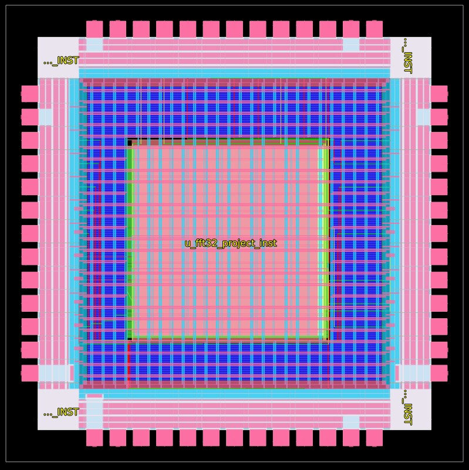
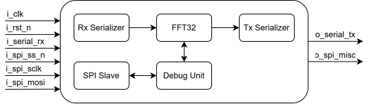
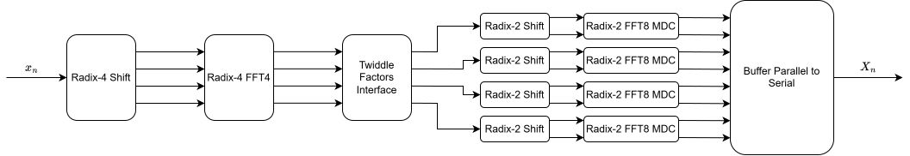
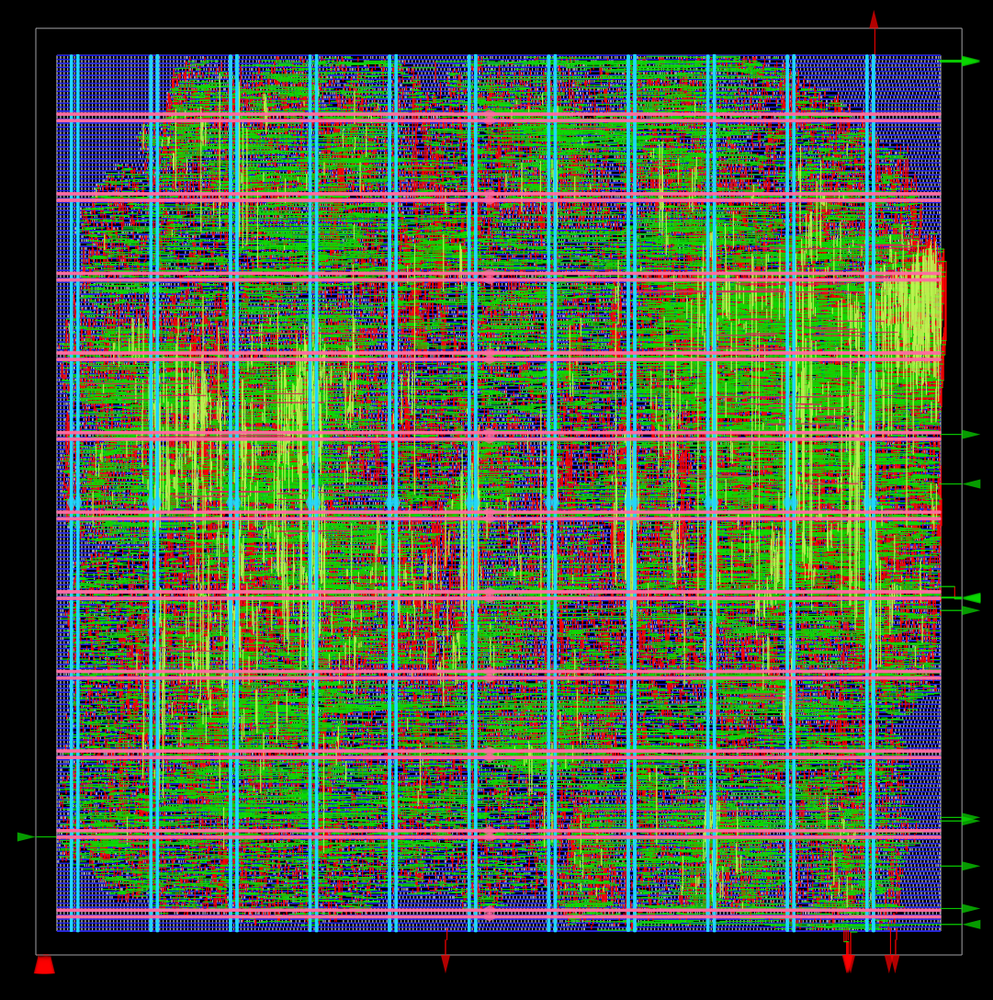
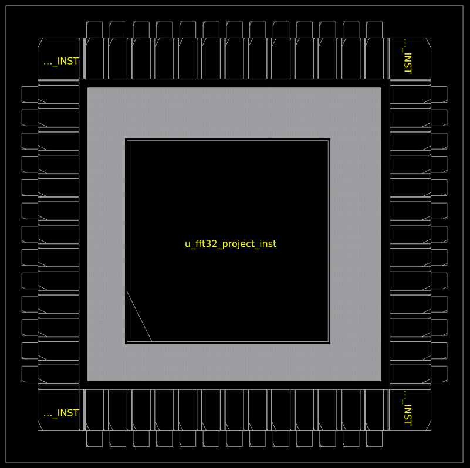

# Parallel 32-Point FFT (UNIC-CASS 2025)

## Project Overview

This repository hosts the **RTL source code and Physical Implementation** deliverables for the **32-point FFT Processor Project**, submitted as part of the **UNIC-CASS 2025** program.

The design implements a high-performance **Mixed-Radix (Radix-4 + Radix-8)** Fast Fourier Transform accelerator, targeting the **IHP 130nm Open Source PDK**. The architecture is optimized for pin-constrained environments, featuring a serialized 8-bit I/O interface and a dedicated SPI debug subsystem.

This milestone represents the **Mock Tapeout**, validating the complete RTL-to-GDSII flow, integration within the official wrapper, and signoff (DRC/LVS/Timing) readiness.

*Fig 1: Final GDSII Assembly of the FFT32 macro integrated within the user_project_wrapper.*

### Documentation
For a deep dive into the architectural decisions, trade-off analysis, and signoff logs, please refer to the comprehensive report:
[**Download Mock Tapeout Report (PDF)**](https://drive.google.com/file/d/1p1vVzE6i_zUoEKxSQf0StdPmlr8pduX8/view?usp=drive_linkE)

## The Team

This project was developed by the following design team members:

- Adan Juan Angel Lema, *Universidad Nacional del Sur*
- Julian Font, *Universidad Nacional de Córdoba*
- Agustín Romero Diaz, *Universidad Tecnológica Nacional*
- Valentina Mosquera, *Universidad Nacional del Sur*
- Federico Ignacio Villar, *Universidad Nacional del Sur*

And the Team Mentor is Ariel Luis Pola, from *Universidad Nacional de Córdoba*.

## Detailed Architecture

The design is hierarchically structured into three main functional domains: **Input/Output Serialization**, the **FFT Computational Core**, and the **Debug/Control Plane**.

*Fig 2: High-level architecture showing the Serialization domains, the FFT Core, and the Debug Subsystem.*

### Data Path Modules

The data path operates on **8-bit signed fixed-point data** (Real and Imaginary components).

* **`rx_serializer` (Input Interface):**
    * **Function:** handles the ingestion of single-bit serial data streams.
    * **Operation:** implements a robust **edge-triggered start-bit detector** to synchronize incoming frames. It converts the serial line into parallel 8-bit signed IQ pairs and generates the `rx_valid` signal to wake up the FFT core.
* **`tx_serializer` (Output Interface):**
    * **Function:** serializes the processed parallel data back onto a single output pin.
    * **Operation:** accepts valid results from the FFT core, buffers them to match the baud rate, and transmits them bit-by-bit. It provides a `tx_ready` handshake signal to apply backpressure to the core if necessary.
* **`fft32` (The Computational Core):**
    * The central processing unit decomposes the 32-point FFT into a mixed-radix architecture (Radix-4 followed by Radix-8 stages).
    * **`shift_r4`:** input reordering buffer to align serial data for the parallel Radix-4 stage.
    * **`fft4`:** performs the first stage of butterflies (4-point DFT) in parallel.
    * **`twiddle_interface`:** applies complex multiplication factors (Twiddle Factors). These are stored in optimized lookup tables implemented via **combinatorial MUX logic** for synthesis efficiency, handling both Forward and Inverse coefficients.
    * **`shift_r2`:** intermediate data reordering and commutator stage.
    * **`fft8`:** the backend processing engine using a pipelined **MDC (Multipath Delay Commutator)** architecture.
        * Consists of sequential stages (`mdc8p_stage1` to `stage3`) instantiating the fundamental Butterfly units (`btfly_2`).
    * **`buffer_parallel2serial`:** captures the parallel output from the 8 pipelines and serializes it internally for the final output stage.

*Fig 3: FFT32 Core detailed block diagram.*

### Debug & Control Modules

A key feature is the observability system running in parallel to the datapath.

* **`spi_slave_mode0`:**
    * Implements a standard 4-wire SPI protocol (CPOL=0, CPHA=0) to handle bit-level shifting and frame synchronization.
* **`debug_unit`:**
    * **Function:** bridges the external SPI commands with the internal chip logic.
    * **CDC (Clock Domain Crossing):** Includes synchronizers to safely transfer signals between the asynchronous SPI domain and the fast system clock domain. It manages **Control Registers** (Configuration) and **Probe Registers** (Status/Sniffing).

---

## System Operation

1.  **Initialization:** upon power-up, the system enters a safe state. The user can utilize the SPI interface to assert/deassert a **Soft Reset** or toggle the **System Enable** bit via the `sys_config` register.
2.  **Processing:**
    * Serial data is received on `i_serial_rx`.
    * The `rx_serializer` frames the data and passes 8-bit complex words to the `fft32`.
    * Data flows through the split-pipeline (`fft4` $\to$ `twiddle` $\to$ `fft8`).
    * The result is serialized and transmitted on `o_serial_tx`.
3.  **Observability (Glue Logic):**
    * **Counters:** the top level counts valid inputs (`cnt_inputs`) and valid outputs (`cnt_outputs`) to detect packet loss.
    * **Saturation Detection:** a bit in the `error_flags` register latches high if any output value hits the maximum positive or negative rail (+127/-128), indicating clipping.

---

## Interface Specifications (Pinout)

The design is optimized for a minimal footprint, utilizing exactly **8 Digital IO Pins** (excluding Power/Ground).

| Pin Name | Direction | Description |
| :--- | :---: | :--- |
| **System Signals** | | |
| `i_clk` | Input | Main System Clock. |
| `i_rst_n` | Input | Asynchronous Hardware Reset (Active Low). |
| **Data Interface** | | |
| `i_serial_rx` | Input | Serial Data Input (FFT samples). |
| `o_serial_tx` | Output | Serial Data Output (FFT results). |
| **Debug Interface (SPI)** | | |
| `i_spi_ss_n` | Input | SPI Slave Select (Active Low). Acts as CDC trigger. |
| `i_spi_sclk` | Input | SPI Serial Clock. |
| `i_spi_mosi` | Input | Master Out Slave In (Configuration Data). |
| `o_spi_miso` | Output | Master In Slave Out (Status Readback). |

---

## Register Map

The Debug Unit exposes the following memory-mapped registers via SPI:

### Control Registers (Read/Write)
* **0x10 - `sys_config`**:
    * `[0]`: **FFT Enable** (1 = Run, 0 = Pause).
    * `[1]`: **Inverse Mode** (1 = IFFT, 0 = FFT).
    * `[2]`: **Soft Reset** (1 = Reset Internal Logic).

### Status Registers (Read Only)
* **0x00 - `status_flags`**: Real-time status of Valid/Ready signals.
* **0x01 - `error_flags`**: Clipping detection (Sticky bit).
* **0x02 - `cnt_inputs`**: Counter of received words.
* **0x03 - `cnt_outputs`**: Counter of calculated FFTs.
* **0x04 - `last_out_re`**: Last valid Real output value.
* **0x05 - `last_out_im`**: Last valid Imaginary output value.
* **0x06 - `mid_data_re`**: Intermediate debug probe (Twiddle output).

### Debug Subsystem
The design includes a dedicated **SPI Slave (Mode 0)** independent of the main clock domain. It features a **CDC Snapshot mechanism**: upon triggering `CS_N`, internal fast counters and status flags are latched into a shadow register, ensuring stable and bit-coherent readback via the slow SPI bus.

## Physical Implementation Results

The design was hardened using **OpenLane** targeting the **IHP 130nm PDK** and integrated into the official `user_project_wrapper`.

### Signoff Metrics (Mock Tapeout)
The following metrics were obtained from the final integration run (`user_project_wrapper`), validating the design for fabrication readiness.

| Metric | Value | Status |
| :--- | :--- | :--- |
| **Technology** | IHP 130nm | Open PDK |
| **Clock Frequency** | 50 MHz | Target Met |
| **Setup WNS** | **+7.75 ns** | ✅ Timing Clean |
| **Hold WNS** | **+0.29 ns** | ✅ Timing Clean |
| **Die Area** | $2000 \times 2000 \mu m$ | Wrapper Size |
| **Macro Area** | $880 \times 880 \mu m$ | 0.77 $mm^2$ |
| **Utilization** | **67.6%** inside macro, **47.09%** at wrapper level | Optimized for routing |
| **DRC / LVS** | 0 Violations | ✅ Signoff Clean |

### Layout Visualizations

  
  

  <em>Fig 3: (Left) Hardened FFT32 Macro Layout. (Right) Final Placement within the User Project Wrapper.</em>

