# Final Physical Design Report (PD) — `top_fft32`

## Summary

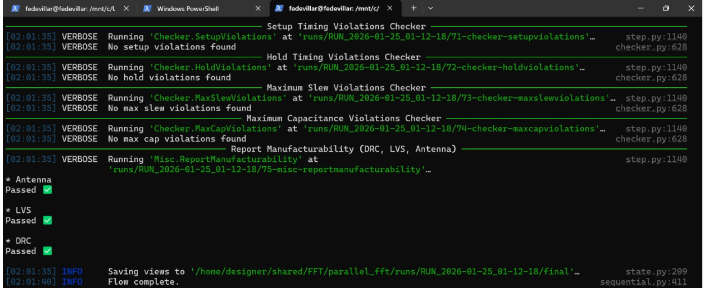


This document summarizes the final results of the Physical Design (PD) signoff run executed for `top_fft32` using LibreLane.  
All signoff checks (DRC/LVS/Antenna) passed, and timing closed with no errors.

## Reference

All numerical results for the selected final version come from:  
👉 Download: **https://drive.google.com/drive/folders/1k56T0UlJXL5wo1JJ8dqQxotg4JW8bLpc?usp=sharing**

---

## Area Sweep Summary and Final Selection

Multiple physical design runs were executed using the LibreLane flow, exploring different DIE/CORE area configurations and effective utilization levels.  
All configurations listed below were evaluated through full signoff (DRC/LVS/Antenna).  
The goal of this sweep was to identify the minimum viable area while maintaining robustness, and to justify the final selected configuration with enough margin for future RTL changes.

### Sweep Cases

| Case (Run) | DIE_AREA [µm] | CORE_AREA [µm] | Die Area [mm²] | Core Area [mm²] | Utilization | CTS / Placement | DRC / LVS / Antenna | Notes |
|---|---:|---:|---:|---:|---:|---|---|---|
| **util67** (RUN_2026-01-25_01-12-18) | [0, 0, 880, 880] | [20.16, 22.68, 859.68, 854.28] | 0.7744 | 0.698145 | 0.675807 | Skew setup worst: -0.102 ns (slow). Displacement mean/max: 1.014 / 22.92 | OK (route DRC=0, Magic=0, KLayout=0, LVS=0, Antenna=0) | IR drop worst 7.93 mV. Fanout viol: 1091. Much filler (30483). Typical warnings: GRT-0281=1, CTS-0041=13, DRT-0349=10 |
| **util71** (RUN_2026-01-25_00-17-43) | [0, 0, 860, 860] | [20.16, 22.68, 830.88, 831.60] | 0.7396 | 0.655808 | 0.715659 | Skew setup worst: -0.106 ns (slow). Displacement mean/max: 1.235 / 27.48 | OK (route DRC=0, Magic=0, KLayout=0, LVS=0, Antenna=0) | IR drop worst 5.86 mV (best of the 3). Fanout viol: 1060. Filler 26682. Typical warnings: GRT-0281=1, CTS-0041=13, DRT-0349=10 |
| **util84** (RUN_2026-01-25_02-52-14) | [0, 0, 840, 840] | [20.16, 22.68, 766.56, 767.34] | 0.7056 | 0.555814 | 0.837240 | Skew setup worst: -0.170 ns (slow). Displacement mean/max: 5.798 / 221.34 (high) | OK (route DRC=0, Magic=0, KLayout=0, LVS=0, Antenna=0) | IR drop worst 6.84 mV. Fanout viol: 985. Much “tighter”; displacement suggests congestion/fragility. Typical warnings: GRT-0281=1, CTS-0041=13, DRT-0349=10 |

---

## Decision

**Select run `util67` (DIE 880×880 µm, CORE ~0.698 mm², utilization 67.6%) as the final baseline.**

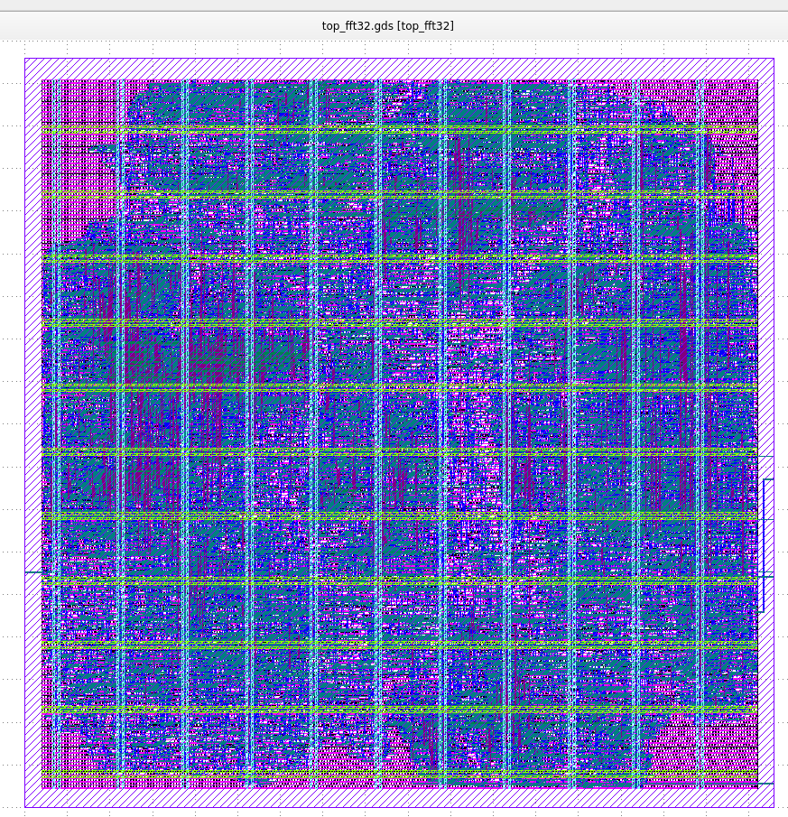

If die size must be reduced, validated alternatives already exist:

- **util71**: DIE 860×860 µm, utilization ~71.6%, full closure (timing/DRC/LVS/antenna OK).  
- **util84**: DIE 840×840 µm, utilization ~83.7%, full closure but with indicators of higher pressure/congestion (more sensitive to changes).

### Primary Reason

Prioritize physical margin to absorb future RTL changes (more logic, buffers, reroute, constraint updates) without risking flow closure.

**Technical evidence** (in `runs/RUN_2026-01-25_01-12-18_util67/final/metrics.json`)  
- Area margin / lower congestion pressure  
- Placement “health” indicators


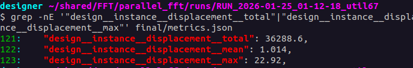

Comparatively, the tightest run (`util84`) showed extreme displacement values, indicating higher fragility to changes.


---

## Full and Clean Flow Closure

### Timing Closure (STA)

Across the 3 corners:


With these results, timing closes cleanly: **0 setup/hold violations, WNS/TNS = 0**, with very comfortable setup slack (**WS = 8.407 ns**) and positive hold slack (**WS = 0.099 ns**).  
Clean closure, with very comfortable setup slack and positive hold slack.


### DRC (Routing + Signoff)

DRC: clean!


### LVS / XOR

LVS all at 0:

LVS: pass!

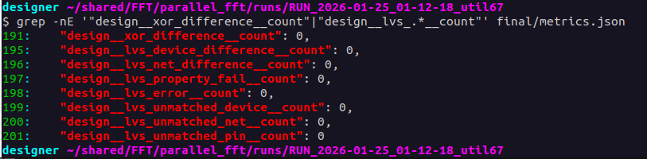

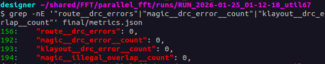

### Antenna
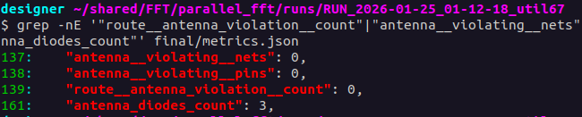

Antenna: no violations (diodes inserted: `antenna_diodes_count = 3`)

### Skew

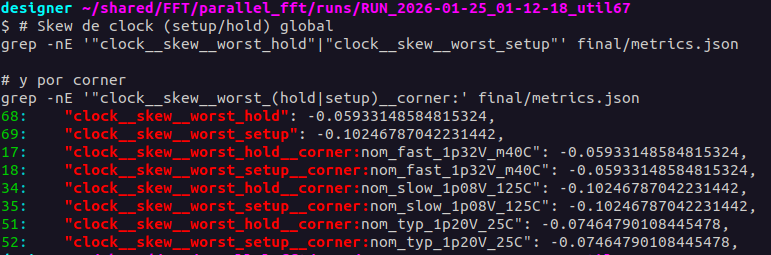

CTS maximum skew is ~0.10 ns across corners, and the design maintains clean timing closure (0 violations, WNS/TNS = 0).  
If skew were problematic, it would first appear as hold/setup violations.

---

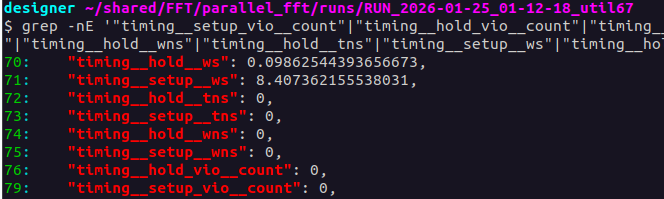

## No Power Grid Violations

Signoff shows no power grid violations: **VPWR/VGND = 0**.

---

## Healthy IR-Drop

`ir__drop__worst ≈ 7.93 mV` (<1% of 1.2 V), consistent and not limiting.

Since the objective is robustness against RTL changes, PDN/IR does not appear to be a bottleneck.

---

## Fill Cells vs Standard Cells

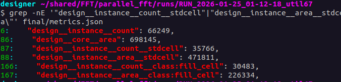

- Stdcell area: 471,811 / 698,145 → **67.58%**  
- Fill area: 226,334 / 698,145 → **32.42%**

---

## Routing Warning: DRT-0349 (LEF58_ENCLOSURE)

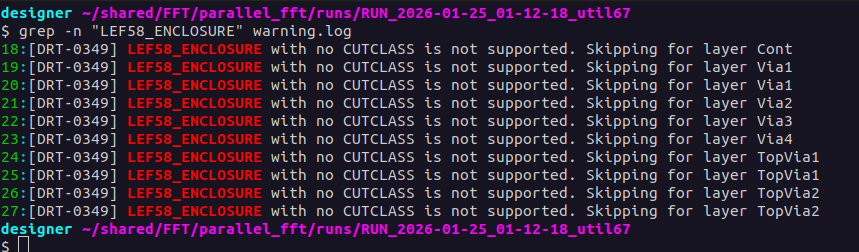

During routing, warnings of the type `DRT-0349: LEF58_ENCLOSURE ...` appear. This was discussed in the Element channel (UNIC CASS 2025):  
https://app.element.io/#/room/#unic-cass-2025:fossi-chat.org

It was indicated that this behavior is expected with the PDK and does not represent a design issue. It was confirmed safe to ignore; in the worst case, if it affected relevant rules, it would show up as DRC errors later in the flow—which did not occur in our runs (DRC signoff = 0).

---

## CHIP FINISH!

LibreLane automatically performs chip finishing during the final stages of the flow, including insertion of filler cells, tap cells, and well ties.  
The presence of **30483 filler cells** confirms that empty standard-cell rows were properly filled, ensuring continuous substrate coverage and a clean DRC layout.

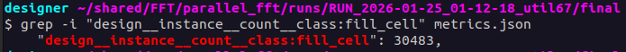

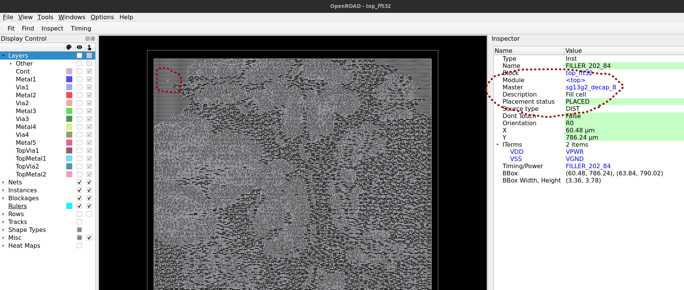
---

## KLayout

```sh
designer ~/shared/FFT/parallel_fft/runs/RUN_2026-01-25_01-12-18_util67/final 
$ klayout ~/shared/FFT/parallel_fft/runs/RUN_2026-01-25_01-12-18_util67/final/gds/top_fft32.gds
```
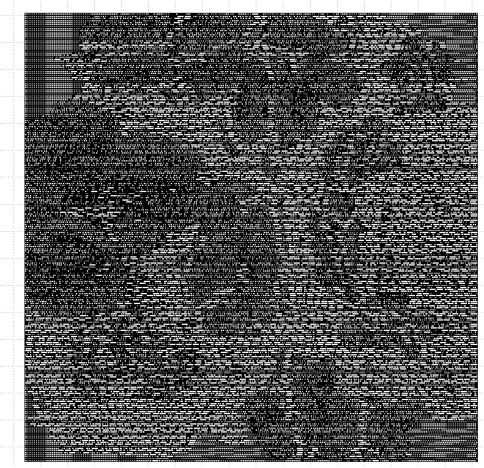

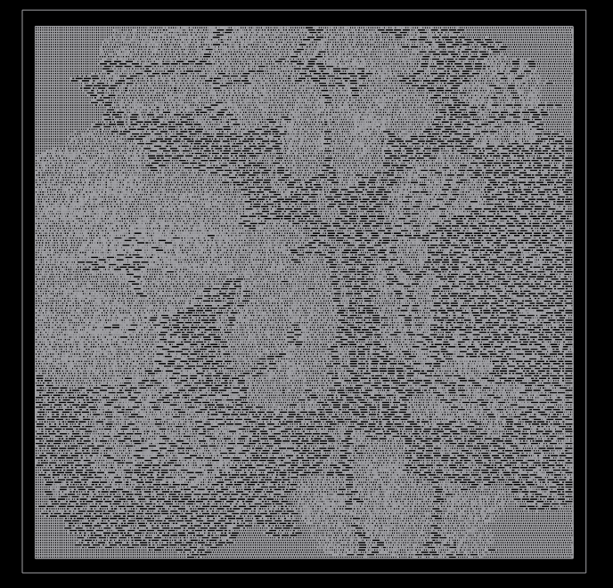


# Colorizing fill cells

## KLayout (Ruby) — highlight DECAP/FILL/TAP/ENDCAP by referenced cell name

~~~ruby
# KLayout Ruby: highlight DECAP/FILL/TAP/ENDCAP by referenced cell name
# Creates marker boxes on layers 900/1..4 so you can color them via Layer Properties.

mw   = RBA::Application.instance.main_window
view = mw.current_view
raise "No active view" unless view

cv = view.active_cellview
raise "No active cellview" unless cv && cv.is_valid?

ly  = cv.layout
top = cv.cell

# Target marker layers (change if you want)
l_decap  = ly.layer(900, 1)
l_fill   = ly.layer(900, 2)
l_tap    = ly.layer(900, 3)
l_endcap = ly.layer(900, 4)

# Clear previous markers
[top.shapes(l_decap), top.shapes(l_fill), top.shapes(l_tap), top.shapes(l_endcap)].each(&:clear)

# Regex patterns (local variables -> no "already initialized constant" warnings)
rx_decap  = /decap/i
rx_fill   = /fill/i
rx_tap    = /(tap|tapcell|welltap)/i
rx_endcap = /(endcap|end_cap|end-cap|boundary)/i

# Classify a referenced cell name into a category
classify = lambda do |name|
  n = name.to_s
  next :decap  if n =~ rx_decap
  next :fill   if n =~ rx_fill
  next :tap    if n =~ rx_tap
  next :endcap if n =~ rx_endcap
  nil
end

# Get instance transform (KLayout builds differ: trans vs dtrans)
inst_tr = lambda do |inst|
  return inst.trans  if inst.respond_to?(:trans)
  return inst.dtrans if inst.respond_to?(:dtrans)
  RBA::Trans.new
end

cnt  = Hash.new(0)
seen = {}

# Manual hierarchical walk (works even when begin_instances_rec API differs)
walk = lambda do |cell, parent_tr|
  key = [cell.cell_index, parent_tr.to_s]
  return if seen[key]
  seen[key] = true

  cell.each_inst do |inst|          # In your build this yields RBA::Instance
    ref = inst.cell                 # Referenced cell
    next unless ref

    tr  = parent_tr * inst_tr.call(inst)
    cat = classify.call(ref.name)

    if cat
      bb = ref.bbox.transformed(tr) # bbox in TOP coordinates

      case cat
      when :decap  then top.shapes(l_decap).insert(RBA::Box.new(bb))
      when :fill   then top.shapes(l_fill).insert(RBA::Box.new(bb))
      when :tap    then top.shapes(l_tap).insert(RBA::Box.new(bb))
      when :endcap then top.shapes(l_endcap).insert(RBA::Box.new(bb))
      end

      cnt[cat] += 1
    end

    # Always descend into hierarchy to catch targets deeper down
    walk.call(ref, tr)
  end
end

walk.call(top, RBA::Trans.new)

puts "==== Counts ===="
puts "DECAP : #{cnt[:decap]}"
puts "FILL  : #{cnt[:fill]}"
puts "TAP   : #{cnt[:tap]}"
puts "ENDCAP: #{cnt[:endcap]}"
puts "==============="

# Refresh view (API differs by version)
view.add_missing_layers if view.respond_to?(:add_missing_layers)
view.update            if view.respond_to?(:update)
view.zoom_fit          if view.respond_to?(:zoom_fit)
~~~

`design__instance__count__class:fill_cell = 30483`, which makes sense since the sum of **DECAP** and **FILL** gives that.

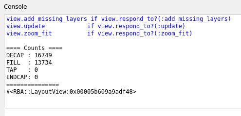

Only the **decap** and **fill** are observed as colored.

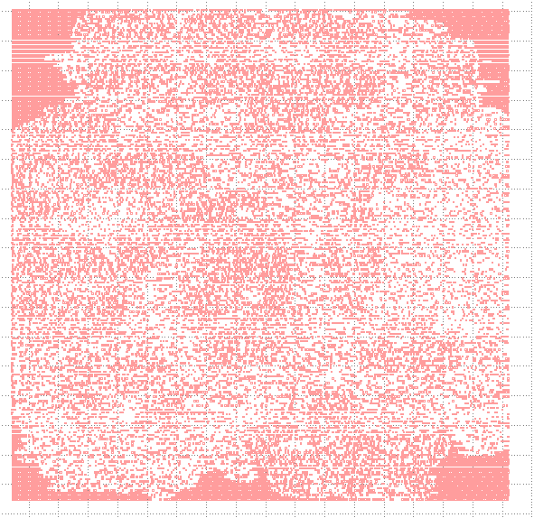

## OpenROAD

Same idea but in OpenROAD:

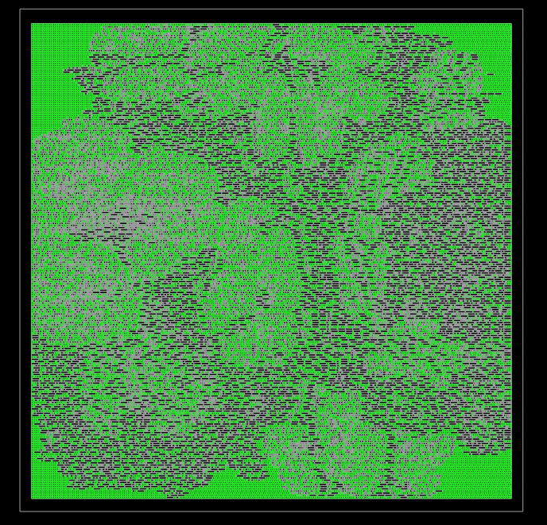
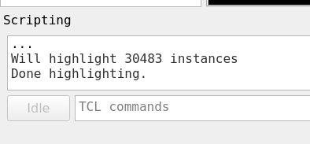
### IO PINS

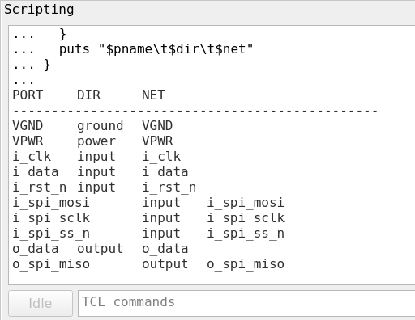
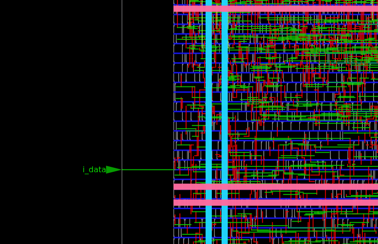
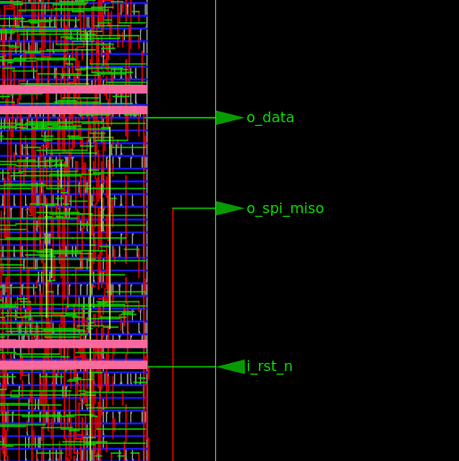
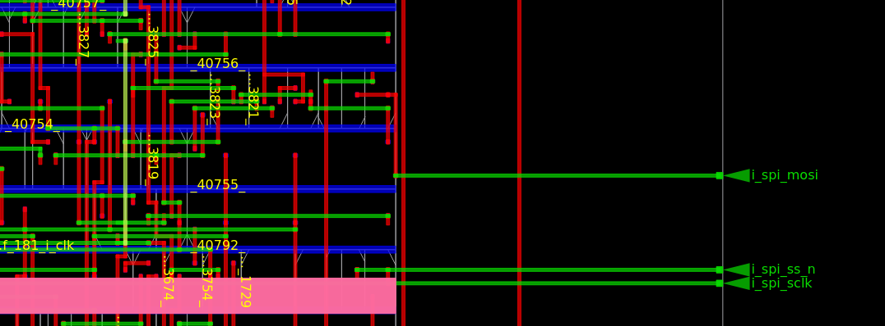
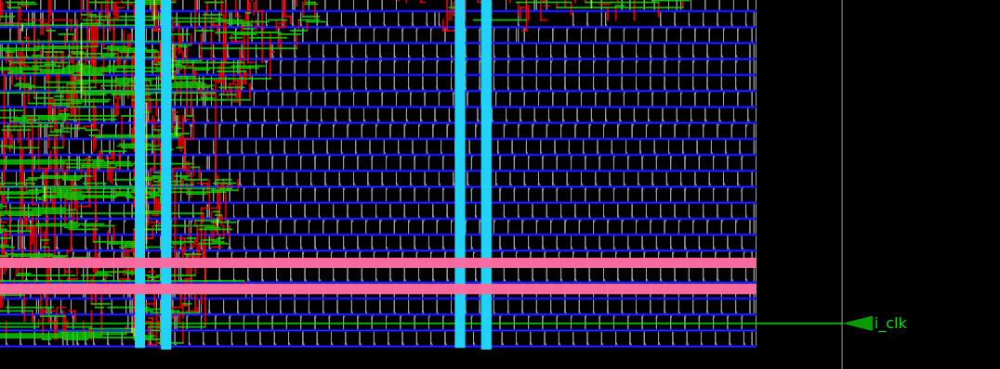

### CTS

~~~tcl
# ============================================================
# MULTI-CLOCK TREE HIGHLIGHT (OpenROAD GUI) -- ROBUST
# - Starts from the PORT net (or fallback)
# - BFS through BUF/INV cells
# - Avoids STA-2201/2204: never get_property on strings
# - Paints with "select -highlight <id>" if available
#   (colors by group), else fallback to gui::highlight_*
# ============================================================

# ---------------- filters ----------------
proc is_clkbuf {ref}   { expr {[regexp -nocase {(buf|inv)} $ref]} }
proc is_antenna {ref}  { expr {[regexp -nocase {antenna} $ref]} }

# ---------------- helpers: handle vs string ----------------
proc is_handle {x} {
  if {$x eq "" || $x eq "NULL"} { return 0 }
  return [expr {![catch {get_name $x} _]}]
}

proc db_name {x} {
  if {$x eq "" || $x eq "NULL"} { return "" }
  if {[is_handle $x]} { return [get_name $x] }
  return $x
}

proc cell_obj {maybe_obj_or_name} {
  if {$maybe_obj_or_name eq "" || $maybe_obj_or_name eq "NULL"} { return "" }
  if {[is_handle $maybe_obj_or_name]} { return $maybe_obj_or_name }
  set name $maybe_obj_or_name
  set c [lindex [get_cells -hier $name] 0]
  return $c
}

proc cell_ref_name {cobj_or_name} {
  set c [cell_obj $cobj_or_name]
  if {$c eq ""} { return "" }
  if {[catch {get_property $c ref_name} ref]} { return "" }
  return $ref
}

# ---------------- clear highlights/selections ----------------
proc clear_all_highlights {} {
  catch { ::gui::clear_highlights }
  # some versions use "gui::clear_selections" or "select -clear"
  catch { ::gui::clear_selections }
  catch { select -clear }
}

# ---------------- detect if "select" exists ----------------
proc has_select_highlight {} {
  if {[llength [info commands select]] == 0} { return 0 }
  # not all versions support -highlight; test with catch "dry run"
  if {[catch {select -type Net -name __NOEXIST__ -highlight 1} _]} {
    # If it fails because net doesn't exist but recognizes -highlight, it's fine.
    # If it fails due to "unknown option -highlight", it doesn't work.
    if {[string match "*unknown option*highlight*" $_]} { return 0 }
  }
  return 1
}

# ---------------- painting (prefer select -highlight) ----------------
proc hl_net {net_name hl_id} {
  if {$net_name eq "" || $net_name eq "NULL"} { return }
  if {[has_select_highlight]} {
    # Note: some versions require -add; if it fails, retry without -add
    if {[catch {select -type Net -name $net_name -highlight $hl_id -add} _]} {
      catch {select -type Net -name $net_name -highlight $hl_id}
    }
  } else {
    # Fallback (no color, but highlights)
    catch { ::gui::highlight_net $net_name }
  }
}

proc hl_inst {inst_name hl_id} {
  if {$inst_name eq "" || $inst_name eq "NULL"} { return }
  if {[has_select_highlight]} {
    if {[catch {select -type Inst -name $inst_name -highlight $hl_id -add} _]} {
      catch {select -type Inst -name $inst_name -highlight $hl_id}
    }
  } else {
    catch { ::gui::highlight_inst $inst_name }
  }
}

# ---------------- get net connected to a top-level port ----------------
# Avoids: get_pins -of_objects Port (STA-0100 on some builds)
proc port_net_name {port_name} {
  # 1) Often the net has the same name as the port
  if {[llength [get_nets $port_name]] > 0} {
    return $port_name
  }

  # 2) OpenDB BTerm if available
  if {![catch {set block [ord::get_db_block]}]} {
    if {![catch {set bt [odb::dbBlock_findBTerm $block $port_name]}] && $bt ne ""} {
      set n [$bt getNet]
      if {$n ne ""} { return [$n getName] }
    }
  }

  # 3) fallback: search something similar
  set cand [get_nets -hier "*$port_name*"]
  if {[llength $cand] > 0} {
    return [db_name [lindex $cand 0]]
  }
  return ""
}

# ---------------- BFS for a clock tree ----------------
proc trace_clk_tree {start_net_name args} {
  array set opt {
    -max_cells 5000
    -hl_nets   1
    -hl_insts  1
    -hl_id     1
    -max_depth -1
  }
  array set opt $args

  set visited_nets  {}
  set visited_cells {}
  set queue [list [list $start_net_name 0]]

  while {[llength $queue] > 0 && [llength $visited_cells] < $opt(-max_cells)} {
    lassign [lindex $queue 0] net_name depth
    set queue [lrange $queue 1 end]

    if {$net_name eq "" || $net_name eq "NULL"} { continue }
    if {$opt(-max_depth) >= 0 && $depth > $opt(-max_depth)} { continue }
    if {[lsearch -exact $visited_nets $net_name] >= 0} { continue }
    lappend visited_nets $net_name

    set net_obj [lindex [get_nets $net_name] 0]
    if {$net_obj eq ""} { continue }

    if {$opt(-hl_nets)} {
      hl_net $net_name $opt(-hl_id)
    }

    foreach p [get_pins -of_objects $net_obj] {
      foreach ctmp [get_cells -of_objects $p] {
        set cname [db_name $ctmp]
        if {$cname eq "" || $cname eq "NULL"} { continue }
        if {[lsearch -exact $visited_cells $cname] >= 0} { continue }

        set cobj [cell_obj $cname]
        if {$cobj eq ""} { continue }  ;# if it doesn't exist as a real cell, skip

        set ref [cell_ref_name $cobj]
        if {$ref eq ""} { continue }
        if {[is_antenna $ref]} { continue }
        if {![is_clkbuf $ref]} { continue }

        lappend visited_cells $cname

        if {$opt(-hl_insts)} {
          hl_inst $cname $opt(-hl_id)
        }

        foreach cp [get_pins -of_objects $cobj] {
          foreach nn_obj [get_nets -of_objects $cp] {
            set nn_name [db_name $nn_obj]
            if {$nn_name eq "" || $nn_name eq "NULL"} { continue }
            if {[lsearch -exact $visited_nets $nn_name] < 0} {
              lappend queue [list $nn_name [expr {$depth+1}]]
            }
          }
        }
      }
    }
  }

  return [list $visited_nets $visited_cells]
}

# ============================================================
# USER CONFIG
# ============================================================

# Clear everything first
clear_all_highlights

# Clock list: {port_name highlight_id}
# highlight_id: 1..9 (each id is usually a different GUI color)
set clock_ports {
  {i_clk      1}
  {i_spi_sclk 2}
}

set max_cells 5000
set hl_nets   1
set hl_insts  1
set max_depth -1   ;# -1 = no limit

puts "INFO: has_select_highlight = [has_select_highlight]"

# ============================================================
# RUN
# ============================================================

foreach pair $clock_ports {
  lassign $pair port hlid

  set start_net [port_net_name $port]
  if {$start_net eq ""} {
    puts "WARN: couldn't find start net for port '$port'"
    continue
  }

  puts "== Clock port: $port  start_net: $start_net  hl_id: $hlid =="

  lassign [trace_clk_tree $start_net             -max_cells $max_cells             -hl_nets   $hl_nets             -hl_insts  $hl_insts             -hl_id     $hlid             -max_depth $max_depth] vnets vcells

  puts "  Visited nets:  [llength $vnets]"
  puts "  Visited cells: [llength $vcells]"
}

puts "Done."
~~~

With that script, it shows the entire “clock tree” running from the port net (`i_clk` and `i_spi_sclk`), following only cells whose `ref_name` matches `(buf|inv)` (and skipping antennas).

In the print:
- `i_clk`: `Visited cells: 553` → it is a large tree, typical for the main clock.
- `i_spi_sclk`: `Visited cells: 37` → small tree (or almost no CTS, or few buffers).

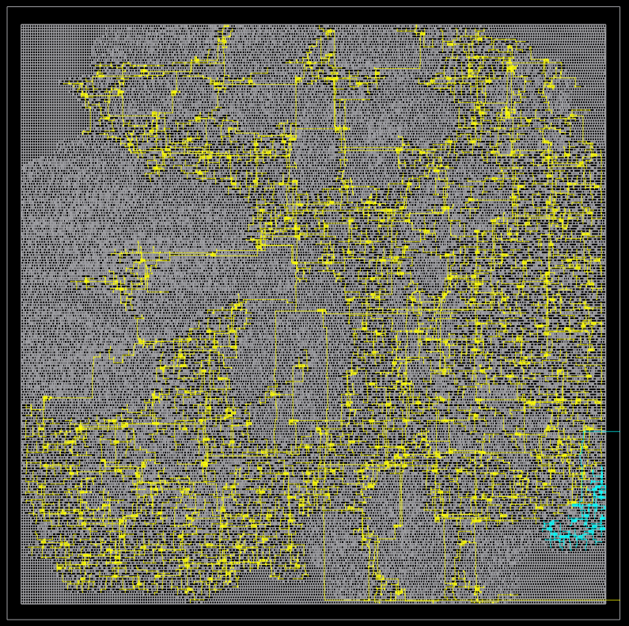

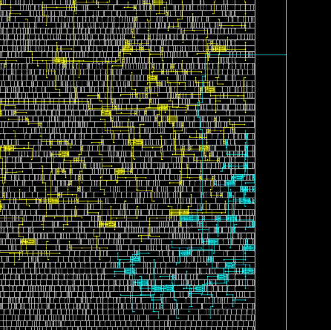

Yellow (`highlight_id = 1`) → everything highlighted that corresponds to the `i_clk` clock tree (nets + BUF/INV instances that BFS found from that port net).

Cyan (`highlight_id = 2`) → everything highlighted that corresponds to the `i_spi_sclk` clock tree (also nets + BUF/INV). In your screenshot you can see a small cyan “blob” at the bottom right: that is the SPI clock.

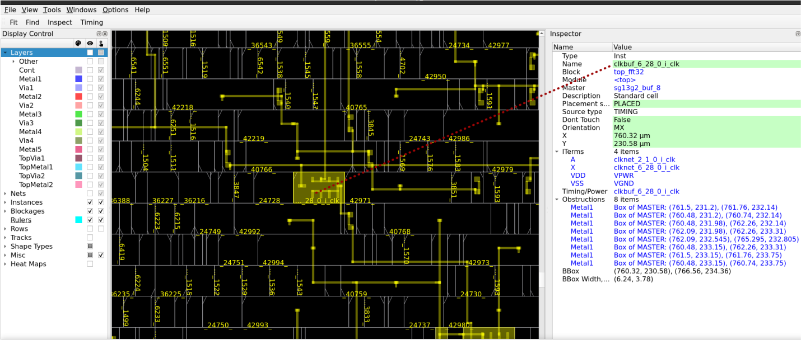


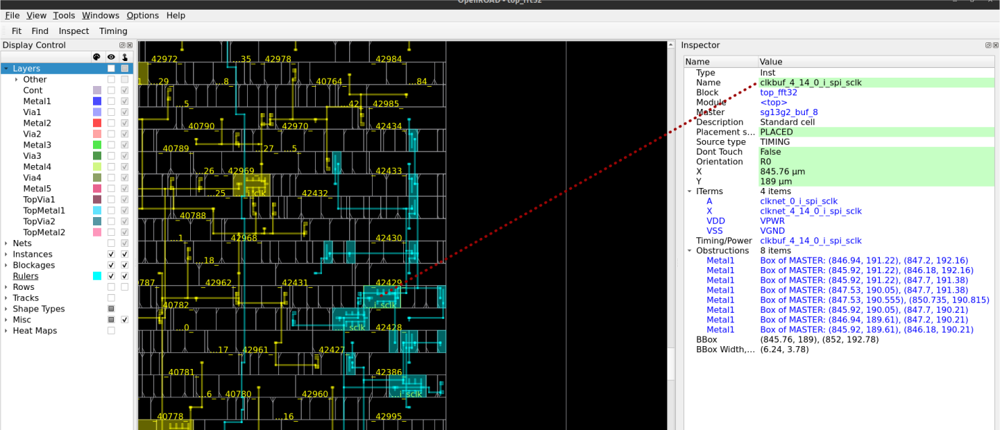