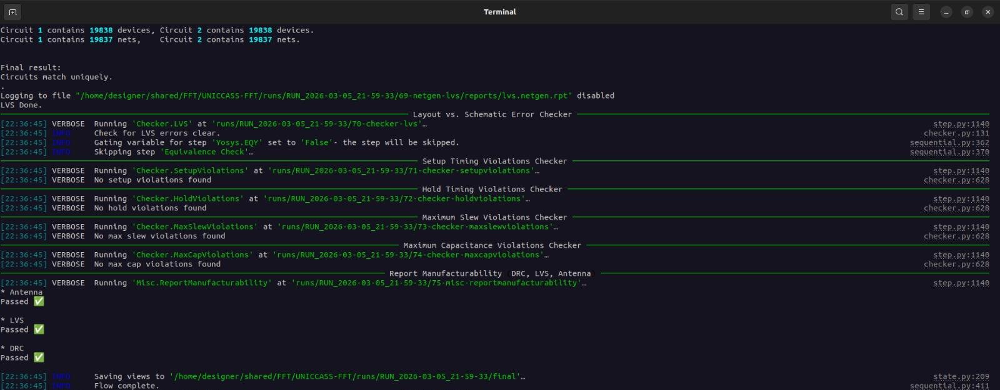
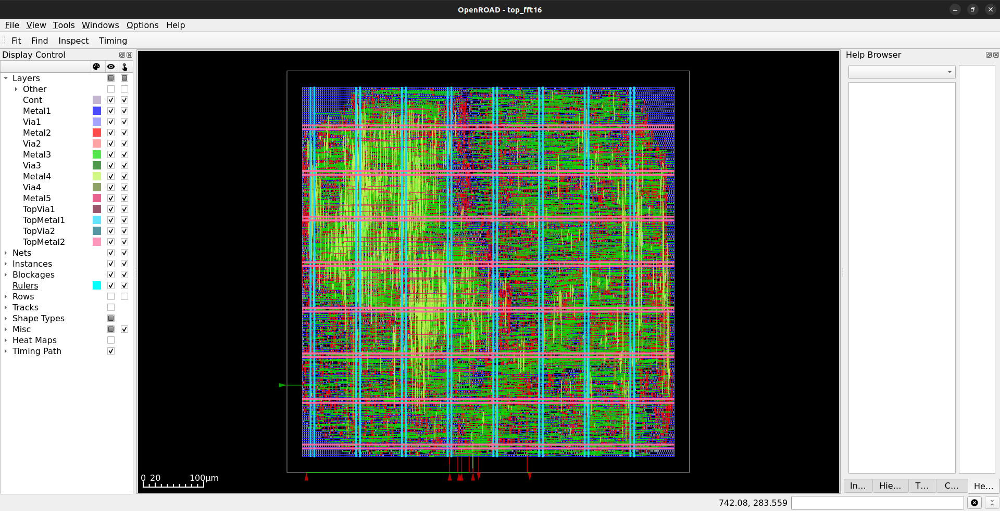
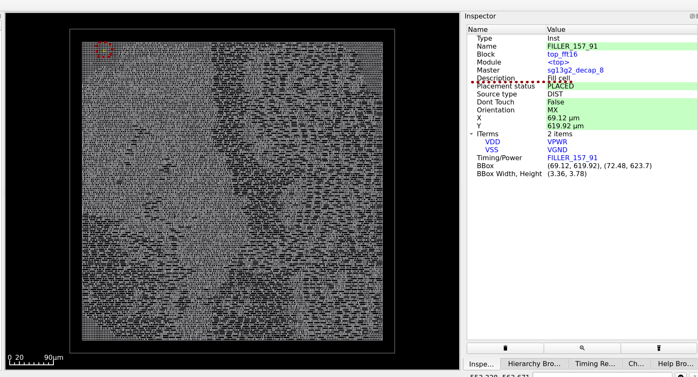
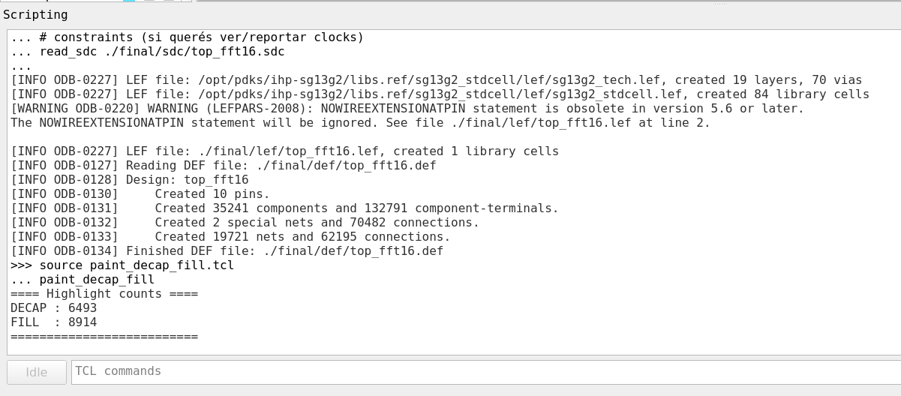
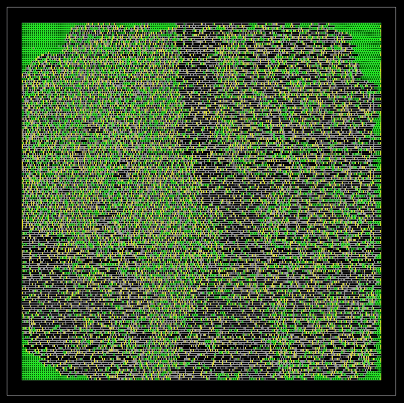
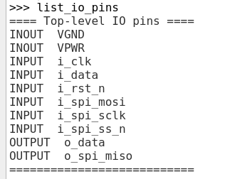
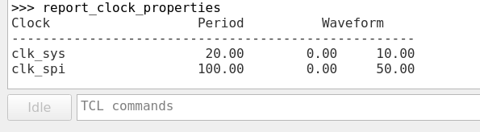
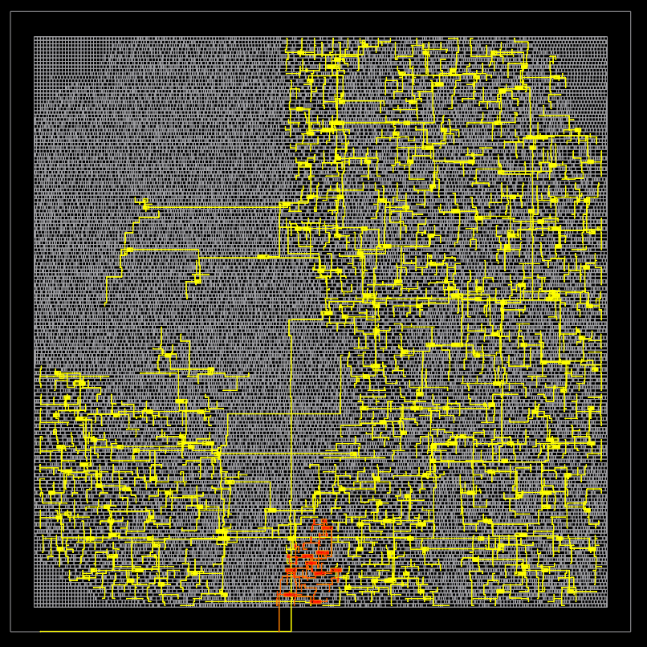
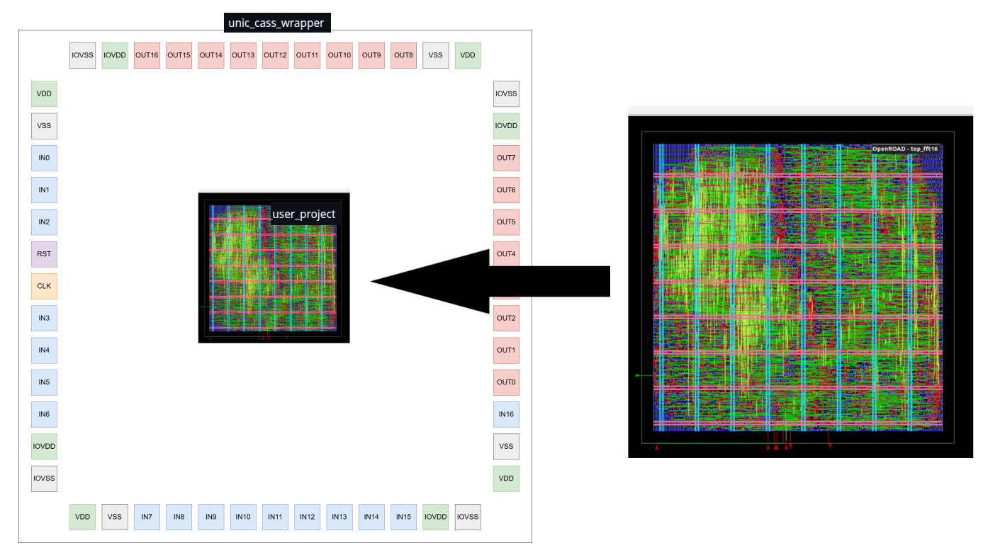
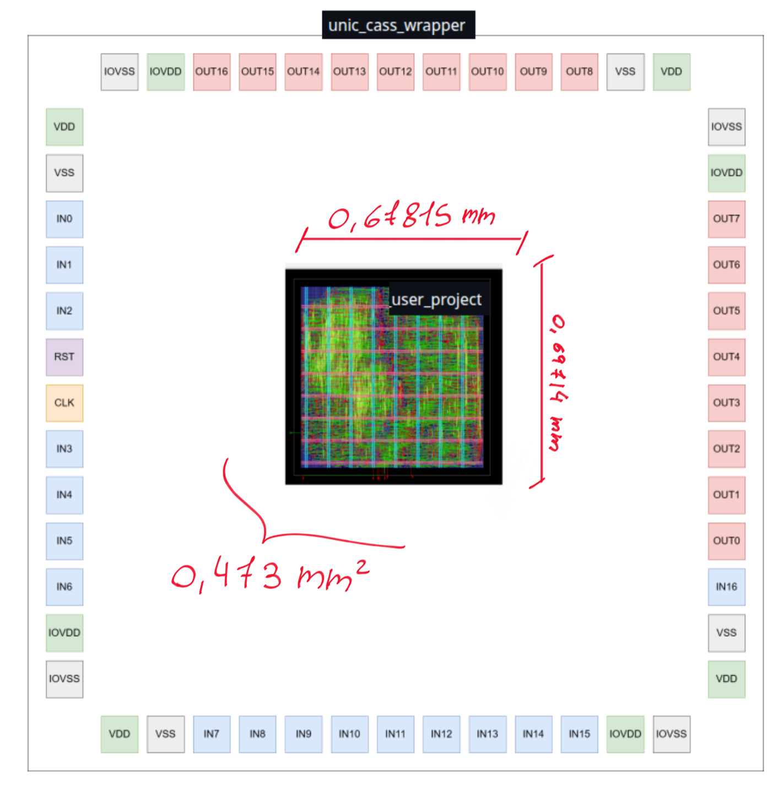

# Final Physical Design Report (PD) — `top_fft16`

## Summary



This document summarizes the final results of the Physical Design (PD) signoff runs executed for `top_fft` using LibreLane.  
Multiple DIE/CORE area configurations were evaluated to identify the minimum viable implementation area while preserving timing closure and clean physical signoff.

All successful runs completed signoff cleanly, with:
- **DRC = 0**
- **LVS = 0**
- **Antenna violations = 0**
- **Setup/Hold violations = 0**

---

## Reference

The following section summarizes the area sweep performed across several floorplan configurations.

## Area Sweep Summary and Final Selection

Multiple physical design runs were executed using the LibreLane flow, exploring different DIE/CORE area configurations and effective utilization levels.  
All successful configurations listed below completed full signoff (DRC/LVS/Antenna clean).  
The goal of this sweep was to identify the minimum viable area while maintaining routing and placement robustness, and to justify the final selected configuration with enough margin for future RTL changes.

### Sweep Cases

| Case (Run) | DIE_AREA [µm] | CORE_AREA [µm] | Die Area [mm²] | Core Area [mm²] | Utilization | CTS / Placement | DRC / LVS / Antenna | Notes |
|---|---:|---:|---:|---:|---:|---|---|---|
| `RUN_2026-03-05_20-25-11` | `[0,0,705,705]` | `[25.44,26.46,679.68,676.62]` | 0.497025 | 0.425361 | 66.92% | Passed | Passed / Passed / Passed | Largest-area option. Very comfortable placement/routing margin, but likely over-conservative. |
| `RUN_2026-03-06_10-39-28` | `[0,0,700,700]` | `[25.44,26.46,669.60,669.06]` | 0.490000 | 0.413937 | 68.75% | Passed | Passed / Passed / Passed | Clean signoff with comfortable margin. Lower utilization than the 666×666 case, zero timing violations across corners, detailed routing converged to 0 DRC, and IR drop remains low. |
| `RUN_2026-03-05_21-59-33` | `[0,0,666,666]` | `[25.44,26.46,640.80,638.82]` | 0.443556 | 0.376822 | 75.48% | Passed | Passed / Passed / Passed | Good compromise between area and margin. Clean signoff with moderate utilization. |
| `RUN_2026-03-05_22-49-50` | `[0,0,620,620]` | `[25.44,26.46,594.72,593.46]` | 0.384400 | 0.322782 | 88.13% | Passed | Passed / Passed / Passed | Smallest successful configuration. Closed timing and signoff clean, but with tighter physical margin. |
| `RUN_2026-03-05_23-35-06` *(failed)* | `[0,0,600,600]` | `[25,25,575,575]` | 0.360000 | 0.302500 | ≈ 94 % | **Failed** at detailed placement post-GPL | N/A | `DPL-0036` detailed placement failed; `GPL-1015` reported very high uniform density (>0.98), indicating congestion/legalization risk. |

---


### Final Area Selection Rationale



Although the **620 × 620 µm** configuration was the smallest floorplan that completed the full signoff flow successfully, its **88.13% utilization** is relatively aggressive and leaves limited margin for future RTL changes, buffering growth, or engineering change orders (ECOs).  
By contrast, the **666 × 666 µm** configuration achieved clean timing and signoff at a more moderate **75.48% utilization**, providing a safer placement and routing margin while still reducing area significantly with respect to the largest evaluated case.

For this reason, the **75.48% utilization point** was selected as the final implementation target.  
This operating point offers a better balance between silicon efficiency and physical-design robustness, while intentionally reserving area headroom for possible future RTL modifications without pushing the design close to congestion or legalization limits.


# Final Physical Design Results — Selected Configuration

The final implementation corresponds to run `RUN_2026-03-05_21-59-33`.

## Floorplan

| Parameter | Value |
|---|---|
| DIE_AREA | `[0,0,666,666]` |
| CORE_AREA | `[25.44,26.46,640.80,638.82]` |
| Selected Utilization | **75.48%** |

This configuration achieved clean physical signoff while maintaining enough area margin for future RTL modifications.

## Floorplan and Area

| Metric | Value |
|---|---|
| Die Bounding Box | `[0.0, 0.0, 666.0, 666.0]` µm |
| Core Bounding Box | `[25.44, 26.46, 640.80, 638.82]` µm |
| Die Area | **0.443556 mm²** |
| Core Area | **0.376822 mm²** |
| Core Utilization | **75.48%** |
| IO Pins | 10 |
| Rows | 162 |
| Placement Sites | 207,684 |

## Design Composition

| Metric | Value |
|---|---|
| Total Instances | 35,241 |
| Standard Cells | 19,834 |
| Sequential Cells | 2,148 |
| Combinational Cells | 15,492 |
| Inverters | 595 |
| Buffers | 5 |

## Clock and Timing Buffers

| Type | Count | Area (µm²) |
|---|---:|---:|
| Clock Buffers | 232 | 6,377.62 |
| Clock Inverters | 111 | 780.192 |
| Timing Repair Buffers | 1,246 | 9,042.97 |

## Fill Cells vs Standard Cells

| Cell Type | Count | Area (µm²) |
|---|---:|---:|
| Standard Cells | 19,834 | 284,427 |
| Fill Cells | 15,407 | 92,394.7 |

Fill cells occupy silicon area but do not implement logic. They are inserted to satisfy density rules and preserve power grid continuity.

## Timing Analysis

### Setup Timing

| Corner | Worst Slack (ns) | Violations |
|---|---:|---:|
| `nom_fast_1p32V_m40C` | 14.810 | 0 |
| `nom_typ_1p20V_25C` | 12.048 | 0 |
| `nom_slow_1p08V_125C` | 7.383 | 0 |

### Hold Timing

| Corner | Worst Slack (ns) | Violations |
|---|---:|---:|
| `nom_fast_1p32V_m40C` | 0.138 | 0 |
| `nom_typ_1p20V_25C` | 0.208 | 0 |
| `nom_slow_1p08V_125C` | 0.329 | 0 |

### Timing Summary

| Metric | Value |
|---|---:|
| Setup Violations | 0 |
| Hold Violations | 0 |
| Setup TNS | 0 |
| Hold TNS | 0 |
| Setup WNS | 0 |
| Hold WNS | 0 |

The design closes timing successfully across all analyzed corners.

## Clock Tree Quality

| Metric | Value |
|---|---:|
| Worst Clock Skew (Hold) | 0.133 ns |
| Worst Clock Skew (Setup) | -0.150 ns |
| Clock Buffers | 232 |
| Clock Inverters | 111 |

The resulting clock tree maintains low skew and balanced clock arrival across sequential elements.

## Routing Metrics

| Metric | Value |
|---|---:|
| Total Nets | 19,721 |
| Total Vias | 118,502 |
| Total Wirelength | 517,626 µm |
| Estimated Wirelength | 469,115 µm |
| Maximum Net Length | 1,695.72 µm |

Routing completed successfully after iterative optimization.

## DRC Results

| Check | Result |
|---|---|
| Routing DRC | 0 errors |
| Magic DRC | 0 errors |
| KLayout DRC | 0 errors |

All design rule checks passed.

## LVS Results

| Metric | Result |
|---|---:|
| Device Differences | 0 |
| Net Differences | 0 |
| Property Failures | 0 |
| LVS Errors | 0 |
| Unmatched Devices | 0 |
| Unmatched Nets | 0 |
| Unmatched Pins | 0 |

The final layout is LVS-clean.

## Antenna Results

| Metric | Value |
|---|---:|
| Violating Nets | 0 |
| Violating Pins | 0 |
| Antenna Violation Count | 0 |
| Inserted Antenna Diodes | 5 |

No antenna violations remain after diode insertion.

## IR Drop and Power Grid

| Metric | Value |
|---|---:|
| Supply Voltage | 1.2 V |
| Worst IR Drop | 0.0031 V |
| Average IR Drop | 8.67e-05 V |
| VPWR Worst Drop | 0.00309853 V |
| VGND Worst Drop | 0.00181482 V |
| Power Grid Violations | 0 |

Power grid integrity is preserved with very small voltage drop.

## Power Consumption

| Power Component | Value |
|---|---:|
| Internal Power | 6.36 mW |
| Switching Power | 1.02 mW |
| Leakage Power | 7.44 µW |
| Total Power | 7.39 mW |

## Signoff Summary

| Check | Result |
|---|---|
| Timing Closure | PASS |
| DRC | PASS |
| LVS | PASS |
| Antenna | PASS |
| IR Drop | PASS |

This configuration was selected as the final implementation point because it provides a better balance between area efficiency and physical-design robustness than the more aggressive 620 × 620 µm case, while still keeping meaningful area savings relative to the 705 × 705 µm run.


----


## Chip Finish

During the final stages of the LibreLane flow, **chip finishing** operations are automatically applied to ensure the layout satisfies fabrication and design-rule requirements.  
These steps include the insertion of **filler cells**, **tap cells**, and **well ties** across the standard-cell rows.

Filler cells are used to occupy unused placement sites and maintain continuous power rails across rows. This prevents gaps in the diffusion and well regions and ensures proper connectivity of the **VPWR** and **VGND** rails.

For the final design:

| Element | Count |
|---|---:|
| Filler Cells | 15,407 |
| Standard Cells | 19,834 |

The presence of **15,407 filler cells** confirms that all unused placement sites were properly filled.  
This guarantees **continuous substrate and well coverage**, helping satisfy fabrication density requirements and contributing to a **DRC-clean layout**.

Additionally, tap and well-tie structures inserted during the flow ensure proper substrate biasing, reducing the risk of latch-up and improving overall reliability of the fabricated chip.




To further analyze the **chip finishing stage**, the final DEF was inspected in the OpenROAD GUI.  
A custom Tcl script was used to highlight and count instances whose master-cell names contain the patterns `decap` and `fill`.

The script produced the following output:



***design__instance__count__class:fill_cell = 15407***

This confirms that the chip finishing stage successfully inserted filler-related cells to occupy unused standard-cell sites.  
These cells ensure:

- Continuous **power rail connectivity**
- Proper **well and substrate coverage**
- Compliance with **density rules**
- A **DRC-clean layout**

Although these cells do not implement logic, they are essential to guarantee manufacturability and physical integrity of the final chip layout.



The figure below shows the final floorplan after the **chip finishing stage**, visualized in the OpenROAD GUI.  
In this view, filler-related cells were highlighted using a custom Tcl script that identifies instances whose master names contain `decap` or `fill`.


### Color Coding

```tcl
proc paint_decap_fill {} {
    gui::clear_highlights -1

    set db [ord::get_db]
    set chip [$db getChip]
    set block [$chip getBlock]

    set decap_count 0
    set fill_count 0

    foreach inst [$block getInsts] {
        set master [$inst getMaster]
        if {$master eq "NULL"} {
            continue
        }

        set master_name [string tolower [$master getName]]
        set inst_name [$inst getName]

        if {[regexp {decap} $master_name]} {
            gui::highlight_inst $inst_name 0
            incr decap_count
        } elseif {[regexp {fill} $master_name]} {
            gui::highlight_inst $inst_name 1
            incr fill_count
        }
    }

    puts "==== Highlight counts ===="
    puts "DECAP : $decap_count"
    puts "FILL  : $fill_count"
    puts "=========================="

    gui::fit
}

proc clear_decap_fill {} {
    gui::clear_highlights -1
}
```

| Color | Cell Type | Description |
|---|---|---|
| Green | DECAP cells | Decoupling capacitors inserted to stabilize local power supply variations and reduce IR noise. |
| Yellow | FILL cells | Physical filler cells used to complete partially empty standard-cell rows. |
| Dark / Gray | Functional standard cells | Logic cells implementing the synthesized design. |


## IO Pin Definition

The top-level IO pins of the design were inspected directly in the OpenROAD database using a Tcl procedure that iterates over all `BTerms` (block terminals).  
The following command was used to print the pin names and their directions:




## Clock Definitions 

Clock information was extracted from the OpenROAD timing database using the command:




The clock distribution network was visualized in the OpenROAD GUI by tracing the clock tree starting from the top-level clock ports.  
A custom TCL script was used to perform a breadth-first traversal (BFS) of the clock network, following only buffer and inverter cells typically used during Clock Tree Synthesis (CTS).

The highlighted network represents the clock distribution tree that propagates the clock signal from the input port through the inserted clock buffers and inverters to all sequential elements in the design.




~~~tcl

# ---------------- filters ----------------
proc is_clkbuf {ref}   { expr {[regexp -nocase {(buf|inv)} $ref]} }
proc is_antenna {ref}  { expr {[regexp -nocase {antenna} $ref]} }

# ---------------- helpers: handle vs string ----------------
proc is_handle {x} {
  if {$x eq "" || $x eq "NULL"} { return 0 }
  return [expr {![catch {get_name $x} _]}]
}

proc db_name {x} {
  if {$x eq "" || $x eq "NULL"} { return "" }
  if {[is_handle $x]} { return [get_name $x] }
  return $x
}

proc cell_obj {maybe_obj_or_name} {
  if {$maybe_obj_or_name eq "" || $maybe_obj_or_name eq "NULL"} { return "" }
  if {[is_handle $maybe_obj_or_name]} { return $maybe_obj_or_name }
  set name $maybe_obj_or_name
  set c [lindex [get_cells -hier $name] 0]
  return $c
}

proc cell_ref_name {cobj_or_name} {
  set c [cell_obj $cobj_or_name]
  if {$c eq ""} { return "" }
  if {[catch {get_property $c ref_name} ref]} { return "" }
  return $ref
}

# ---------------- clear highlights/selections ----------------
proc clear_all_highlights {} {
  catch { ::gui::clear_highlights }
  # some versions use "gui::clear_selections" or "select -clear"
  catch { ::gui::clear_selections }
  catch { select -clear }
}

# ---------------- detect if "select" exists ----------------
proc has_select_highlight {} {
  if {[llength [info commands select]] == 0} { return 0 }
  # not all versions support -highlight; test with catch "dry run"
  if {[catch {select -type Net -name __NOEXIST__ -highlight 1} _]} {
    # If it fails because net doesn't exist but recognizes -highlight, it's fine.
    # If it fails due to "unknown option -highlight", it doesn't work.
    if {[string match "*unknown option*highlight*" $_]} { return 0 }
  }
  return 1
}

# ---------------- painting (prefer select -highlight) ----------------
proc hl_net {net_name hl_id} {
  if {$net_name eq "" || $net_name eq "NULL"} { return }
  if {[has_select_highlight]} {
    # Note: some versions require -add; if it fails, retry without -add
    if {[catch {select -type Net -name $net_name -highlight $hl_id -add} _]} {
      catch {select -type Net -name $net_name -highlight $hl_id}
    }
  } else {
    # Fallback (no color, but highlights)
    catch { ::gui::highlight_net $net_name }
  }
}

proc hl_inst {inst_name hl_id} {
  if {$inst_name eq "" || $inst_name eq "NULL"} { return }
  if {[has_select_highlight]} {
    if {[catch {select -type Inst -name $inst_name -highlight $hl_id -add} _]} {
      catch {select -type Inst -name $inst_name -highlight $hl_id}
    }
  } else {
    catch { ::gui::highlight_inst $inst_name }
  }
}

# ---------------- get net connected to a top-level port ----------------
# Avoids: get_pins -of_objects Port (STA-0100 on some builds)
proc port_net_name {port_name} {
  # 1) Often the net has the same name as the port
  if {[llength [get_nets $port_name]] > 0} {
    return $port_name
  }

  # 2) OpenDB BTerm if available
  if {![catch {set block [ord::get_db_block]}]} {
    if {![catch {set bt [odb::dbBlock_findBTerm $block $port_name]}] && $bt ne ""} {
      set n [$bt getNet]
      if {$n ne ""} { return [$n getName] }
    }
  }

  # 3) fallback: search something similar
  set cand [get_nets -hier "*$port_name*"]
  if {[llength $cand] > 0} {
    return [db_name [lindex $cand 0]]
  }
  return ""
}

# ---------------- BFS for a clock tree ----------------
proc trace_clk_tree {start_net_name args} {
  array set opt {
    -max_cells 5000
    -hl_nets   1
    -hl_insts  1
    -hl_id     1
    -max_depth -1
  }
  array set opt $args

  set visited_nets  {}
  set visited_cells {}
  set queue [list [list $start_net_name 0]]

  while {[llength $queue] > 0 && [llength $visited_cells] < $opt(-max_cells)} {
    lassign [lindex $queue 0] net_name depth
    set queue [lrange $queue 1 end]

    if {$net_name eq "" || $net_name eq "NULL"} { continue }
    if {$opt(-max_depth) >= 0 && $depth > $opt(-max_depth)} { continue }
    if {[lsearch -exact $visited_nets $net_name] >= 0} { continue }
    lappend visited_nets $net_name

    set net_obj [lindex [get_nets $net_name] 0]
    if {$net_obj eq ""} { continue }

    if {$opt(-hl_nets)} {
      hl_net $net_name $opt(-hl_id)
    }

    foreach p [get_pins -of_objects $net_obj] {
      foreach ctmp [get_cells -of_objects $p] {
        set cname [db_name $ctmp]
        if {$cname eq "" || $cname eq "NULL"} { continue }
        if {[lsearch -exact $visited_cells $cname] >= 0} { continue }

        set cobj [cell_obj $cname]
        if {$cobj eq ""} { continue }  ;# if it doesn't exist as a real cell, skip

        set ref [cell_ref_name $cobj]
        if {$ref eq ""} { continue }
        if {[is_antenna $ref]} { continue }
        if {![is_clkbuf $ref]} { continue }

        lappend visited_cells $cname

        if {$opt(-hl_insts)} {
          hl_inst $cname $opt(-hl_id)
        }

        foreach cp [get_pins -of_objects $cobj] {
          foreach nn_obj [get_nets -of_objects $cp] {
            set nn_name [db_name $nn_obj]
            if {$nn_name eq "" || $nn_name eq "NULL"} { continue }
            if {[lsearch -exact $visited_nets $nn_name] < 0} {
              lappend queue [list $nn_name [expr {$depth+1}]]
            }
          }
        }
      }
    }
  }

  return [list $visited_nets $visited_cells]
}

# ============================================================
# USER CONFIG
# ============================================================

# Clear everything first
clear_all_highlights

# Clock list: {port_name highlight_id}
# highlight_id: 1..9 (each id is usually a different GUI color)
set clock_ports {
  {i_clk      1}
  {i_spi_sclk 2}
}

set max_cells 5000
set hl_nets   1
set hl_insts  1
set max_depth -1   ;# -1 = no limit

puts "INFO: has_select_highlight = [has_select_highlight]"

# ============================================================
# RUN
# ============================================================

foreach pair $clock_ports {
  lassign $pair port hlid

  set start_net [port_net_name $port]
  if {$start_net eq ""} {
    puts "WARN: couldn't find start net for port '$port'"
    continue
  }

  puts "== Clock port: $port  start_net: $start_net  hl_id: $hlid =="

  lassign [trace_clk_tree $start_net             -max_cells $max_cells             -hl_nets   $hl_nets             -hl_insts  $hl_insts             -hl_id     $hlid             -max_depth $max_depth] vnets vcells

  puts "  Visited nets:  [llength $vnets]"
  puts "  Visited cells: [llength $vcells]"
}

puts "Done."
~~~

From the visualization:

- The clock tree is **distributed across the entire chip area**, reaching all clock sinks.
- Multiple **buffer stages** are inserted to manage clock fanout and reduce skew.
- The tree exhibits a **balanced branching structure**, typical of CTS algorithms aiming to minimize clock skew and insertion delay.
- Clock buffers are concentrated around branching points where the clock signal splits toward different regions of the chip.

### Interpretation

The CTS structure demonstrates that:

- The clock signal is properly propagated to all sequential elements.
- Clock buffering is used to manage large fanout across the design.
- The clock network spans the full placement area, indicating that the design contains distributed synchronous logic blocks.

This visualization confirms the successful generation of the clock distribution network during the physical design flow.


----


## Area Increase Justification: `top_fft16` vs `user_project`




To clearly interpret the reported area increase, it is important to distinguish between the different project contexts:

- **`top_fft16`** (`RUN_2026-03-05_21-59-33`.): the standalone project used as the original reference design, where the FFT block was developed, tested, and documented.
- **`user_project`**: the version derived from `top_fft16`, but already modified to include the required top-level connectivity for later integration with the wrapper pad ring.
- **`unic_cass_wrapper`**: the full wrapper context into which `user_project` is intended to be integrated.

Therefore, the reported comparison is **not** between the standalone FFT block and the full wrapper already instantiated as part of the design database. Instead, it is between:

- the original standalone design (`top_fft16`), and
- a wrapper-ready version (`user_project`) that already includes the extra external connectivity required for integration into the larger wrapper environment.

### Key point

The area of **`user_project`** is larger because it is no longer being implemented as an isolated block. Even though the wrapper itself is not yet counted as part of the reported cell area, the design has already been adapted so that it can be embedded inside the complete wrapper system. That adaptation changes the physical implementation conditions and increases the cost of closure.

### What remains unchanged

The core functional RTL remains almost the same:

- **Sequential cells**: `2148 -> 2148`
- **Multi-input combinational cells**: `15492 -> 15560`

This shows that the FFT computation logic itself is essentially unchanged. The area increase is therefore **not** caused by a major growth in the core algorithmic logic.

### Why `user_project` becomes larger

The increase comes from the fact that `user_project` must now support the physical and top-level connectivity required for later integration into the wrapper. This leads to:

- more top-level interface signals,
- more routing demand,
- more nets and longer interconnect,
- and more implementation overhead inserted by LibreLane.

This is visible in the metrics:

- **IO count**: `10 -> 38`
- **Net count**: `19721 -> 22697`
- **Routed wirelength**: `517626 -> 595252`
- **Global routed wirelength**: `778384 -> 897501`

These changes show that `user_project` is physically more demanding than the standalone `top_fft16` block.

### Main contributor: timing-repair buffers

The most important reason for the area increase is the large number of extra **timing-repair buffers** inserted by LibreLane:

- **Timing-repair buffers**
  - `top_fft16`: `1246`
  - `user_project`: `4141`

- **Timing-repair buffer area**
  - `top_fft16`: `9042.97 µm²`
  - `user_project`: `55990.6 µm²`

Increase:

- `55990.6 - 9042.97 = 46947.63 µm²`

This is the dominant source of the increase in standard-cell area:

- **Standard-cell area**
  - `top_fft16`: `284427 µm²`
  - `user_project`: `331676 µm²`

Increase:

- `331676 - 284427 = 47249 µm²`

Thus, almost the entire increase in standard-cell area is explained by the additional timing-repair buffers inserted to achieve timing closure under the more demanding integration-oriented context.

### Core area increase

The total core area also grows:

- **Core area**
  - `top_fft16`: `376822 µm²`
  - `user_project`: `440400 µm²`

Increase:

- `440400 - 376822 = 63578 µm²`

This means that the design flow required a larger placement and routing region in order to accommodate the extra buffering and the increased routing complexity.

### Fill cells also increase

Because the implementation region becomes larger, the number of fill cells also increases:

- **Fill cells**
  - `top_fft16`: `15407`
  - `user_project`: `16991`

- **Fill cell area**
  - `top_fft16`: `92394.7 µm²`
  - `user_project`: `108724 µm²`

Increase:

- `108724 - 92394.7 = 16329.3 µm²`

These fill cells do not add functionality, but they reflect the larger physical area needed after the design has been adapted for wrapper integration.

### Final interpretation

The correct interpretation is therefore:

- `top_fft16` is the original standalone implementation.
- `user_project` is already prepared to be placed inside the larger `unic_cass_wrapper` environment.
- Because of that, `user_project` requires more physical optimization effort, especially many more timing-repair buffers.
- As a result, its standard-cell area and core area both increase, even though the main FFT RTL logic remains almost unchanged.

### Concise conclusion

> The area of `user_project` is larger than that of `top_fft16` not because the FFT RTL became substantially more complex, but because the design was adapted for integration into the wrapper environment. This integration-oriented version has more top-level connectivity, higher routing demand, and therefore requires significantly more timing-repair buffers and a larger implementation area to achieve closure in LibreLane.


---


## Total Size of `user_project`


The total physical size of `user_project` is given by the **die area** reported by LibreLane.

### Die size

- **Die area**: `472765 µm²` = `0.472765 mm²`

### Die dimensions

From:

- `design__die__bbox = 0.0 0.0 678.15 697.14`

the die dimensions are:

- **Width**: `678.15 µm` = `0.67815 mm`
- **Height**: `697.14 µm` = `0.69714 mm`

### Core size

The usable internal implementation region corresponds to the **core area**:

- **Core area**: `440400 µm²`
- **Core area**: `0.440400 mm²`

From:

- `design__core__bbox = 5.76 15.12 671.52 676.62`

the core dimensions are:

- **Core width**: `671.52 - 5.76 = 665.76 µm` = `0.66576 mm`
- **Core height**: `676.62 - 15.12 = 661.50 µm` = `0.66150 mm`

### Utilization

LibreLane reports the following utilization for `user_project`:

- **Instance utilization**: `0.753124`
- **Standard-cell utilization**: `0.753124`

Expressed as a percentage:

- **Utilization**: `75.3124%`

This means that approximately **75.31% of the core area is occupied by placed standard-cell instances**, while the remaining area is left available for routing resources, optimization margin, legalization, and physical closure.



### Design note on utilization and possible future area reduction

It is possible to further reduce the final area by **pushing the target utilization to a higher value**, which would allow a smaller core and therefore a smaller overall die. In other words, the current implementation is not necessarily the minimum achievable area.

However, at this stage, the utilization has not been made more aggressive on purpose. The reason is that the RTL may still undergo future modifications, and keeping some additional implementation margin is convenient to avoid unnecessary physical redesign constraints in the next iterations.

Therefore, the current area should be interpreted as a **conservative implementation point** that prioritizes robustness and flexibility for possible RTL updates, rather than the absolute minimum area.

### Final statement

> The total size of `user_project` is **472765 µm²**, which is equivalent to **0.472765 mm²**.  
> Its die dimensions are **678.15 µm × 697.14 µm** (`0.67815 mm × 0.69714 mm`).  
> The internal core area is **440400 µm²**, equivalent to **0.440400 mm²**.  
> The current utilization is **75.3124%**.  
> Although a smaller area could likely be achieved by increasing the target utilization, this has not yet been pursued in order to preserve implementation margin in case further RTL modifications are introduced.


----


## Final Design Documentation


### Final layout overview

The final implemented design corresponds to **`user_project_wrapper`**, which contains the complete wrapper-level physical structure together with the embedded **`user_project`** region intended for integration inside the larger wrapper environment.

From the final KLayout views, the layout can be interpreted as follows:

- The **outer structure** corresponds to the complete **wrapper implementation**, including the peripheral integration region and pad-facing interconnect infrastructure.
- The **central square region** corresponds to the **`user_project`** area.
- The surrounding routing region implements the **physical connectivity between the wrapper environment and the embedded project area**.
- The final layout is therefore not just the standalone FFT block, but the **wrapper-ready integrated physical design**.

### Identification of the embedded `Wuser_project`


In the final KLayout screenshots, the **central square block** is clearly distinguishable from the rest of the wrapper.

This region corresponds to the internal **`user_project`** implementation area, while the rest of the layout contains:

- wrapper-level routing,
- peripheral metal structures,
- pad-ring related integration resources,
- and the surrounding implementation margin required for physical closure.

Thus, the final design should be interpreted as a **hierarchical physical integration**, where:

- **`top_fft16`** is the original standalone functional design,
- **`user_project`** is the wrapper-prepared implementation derived from it,
- and **`user_project_wrapper`** is the final top-level integrated layout.

